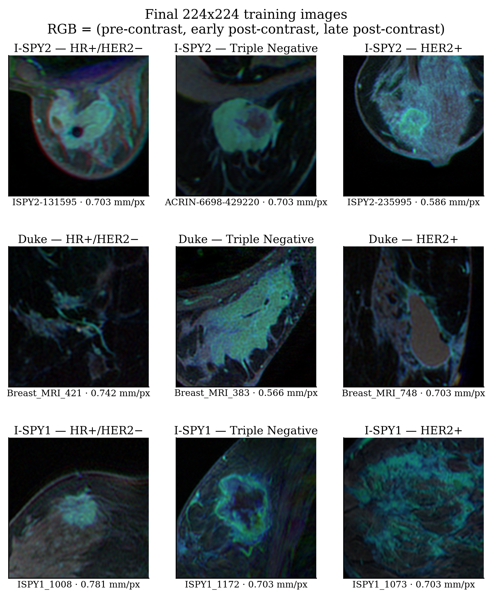

# Federated Learning for Breast Cancer Molecular Subtype Classification

**Master's dissertation — Daniel Mahl Gregorini**

A deployable federated learning system that trains a breast-cancer molecular-subtype
classifier across several hospitals without any medical image leaving the institution
that produced it. The classifier is the vehicle; the measurement is what federation
costs.

Built on **NVIDIA FLARE 2.8.0** in production mode — real PKI, one operating-system
process per hospital, mutual TLS, jobs submitted through the admin API. Not the
simulator.

| | |
|---|---|
| **Task** | 3-class molecular subtype from DCE-MRI: HR+/HER2−, Triple Negative, HER2+ |
| **Dataset** | **BreastDCEDL** (Fridman et al., 2026) — Duke + I-SPY1 + I-SPY2 · 2,063 patients · 16,378 images |
| **Model** | ResNet-18, ImageNet-pretrained, 11,178,051 parameters |
| **Experiments** | 1 centralised baseline + 12 federated runs (FedAvg and FedProx, 2–4 hospitals) |

**BreastDCEDL** · [Paper (Scientific Data)](https://doi.org/10.1038/s41597-026-06589-6) ·
[Download (Zenodo)](https://zenodo.org/records/18114231) ·
[Code (GitHub)](https://github.com/naomifridman/BreastDCEDL)

---

## Research questions

| | Question |
|---|---|
| **RQ1** | Can federated learning reach performance comparable to centralised training? |
| **RQ2** | What is the impact of non-IID data heterogeneity on federated models? |
| **RQ3** | What are the trade-offs between privacy, communication efficiency and performance? |
| **RQ4** | What strategies mitigate the limitations of federated learning in clinical environments? |

---

## The pipeline, end to end

```
raw_dataset_BreastDCEDL/        3-D NIfTI volumes, three DCE phases per patient
        |
        |   notebooks/02_build_dataset.ipynb  ->  src/core/ + src/pipelines/thesis/
        v
dataset/                        16,378 RGB PNGs, 224x224, constant 0.357 mm/px
        |                       R = pre-contrast, G = early post, B = late post
        |
        +---> src/scripts/run_centralized.py -> results/classifier/
        |     one machine, all patients pooled
        |
        +---> src/scripts/partition_data.py
              deployment/data/   per-hospital splits, by patient, never by slice
                    |
                    v
              src/federated/  ->  NVIDIA FLARE  ->  results/federated/
              server + 2-4 hospital clients, 30 rounds x 1 local epoch
```

Each patient's slices stay together in exactly one split and one hospital. Splitting by
slice instead would let the model recognise the patient rather than the disease — the
first defect this project ever shipped, and the reason every split is verified before it
is used.

<p align="center">
  
</p>

---

## What the data looks like

The same slice at every preprocessing step, produced by the same functions the dataset
builder calls:


Final training images, one per cohort and class. Each is a real file from `dataset/`:



---

## Repository layout

| Folder | What it holds |
|---|---|
| **[`raw_dataset_BreastDCEDL/`](raw_dataset_BreastDCEDL/README.md)** | The BreastDCEDL imaging release from Zenodo — 3-D NIfTI volumes and tumour annotations. Never written to. Not in version control; its README explains how to obtain it. |
| **[`dataset/`](dataset/README.md)** | The processed 2-D dataset the network trains on: PNG slices, split manifests and the build configuration that defines them. |
| **[`src/`](src/README.md)** | All the code: the dataset builder, the preprocessing pipelines, the shared trainer, the federated layer and every operational script. |
| **[`deployment/`](deployment/README.md)** | The running system: PKI startup kits, generated jobs, per-hospital data and per-participant logs. |
| **[`results/`](results/README.md)** | Every run that was kept, classifier phase and federated campaign both. |
| **[`docs/`](docs/README.md)** | All documentation and every figure. |
| **[`notebooks/`](notebooks/README.md)** | The pipeline as notebooks, numbered in the order they run: analyse, build, train, evaluate, compare. |

The repository root holds only `README.md` and `requirements.txt`. Everything else
belongs to one of the folders above.

---

## Documentation

Everything lives in **[`docs/`](docs/README.md)**. Start with the first three.

### The dataset

The network trains on 16,378 RGB PNG slices from 2,063 patients across three cohorts.
Each image is 224×224 at a constant 0.357 mm/px, and its three colour channels are three
DCE acquisition time-points — so the *colour* of a voxel encodes how it took up and
released the contrast agent. Splits are at patient level, and the trivial baseline on the
test set is 0.5112.

→ **[How the dataset is organised, column by column, with example images](docs/DATASET_DOCUMENTATION.md)**
→ [Full scientific characterisation](docs/DATASET_REPORT.md) ·
  [Technical specification](docs/DATASET_SPEC.md)

### Preprocessing and imaging

What a DCE-MRI study is and why the channel assignment follows from it; the 80 mm
physical crop window and why it is fixed in millimetres rather than pixels; slice
selection; normalisation scope; and the interventions that were measured and rejected.
Includes the patient-level data-leakage lesson, with the literature that quantifies it.

→ **[Preprocessing and imaging](docs/PREPROCESSING_AND_IMAGING.md)** ·
  [Step-by-step technical reference](docs/PREPROCESSING.md)

### Results

Centralised against federated, framed as an equivalence claim against the measured noise
floor rather than as a failed significance test, and compared with the published
literature on federated learning in medical imaging.

→ **[Results](docs/RESULTS.md)**

### The system

→ [Architecture](docs/ARCHITECTURE.md) · [Deployment](docs/DEPLOYMENT.md) ·
  [Experiment matrix](docs/EXPERIMENTS.md) ·
  [NVFLARE configuration](docs/NVFLARE_CONFIGURATION.md) ·
  [Training parameters](docs/TRAINING_PARAMETERS.md)

---

## How to run it

Five operations, in order. Each links to the folder that documents it properly.

### 0. Install

```bash
pip install -r requirements.txt
```

### 1. Get the raw imaging → [`raw_dataset_BreastDCEDL/`](raw_dataset_BreastDCEDL/README.md)

Run this **from the repository root**:

```bash
python raw_dataset_BreastDCEDL/download_dataset.py
```

About **22 GB** to download, **35 GB** once extracted. The script reads the file list
from the Zenodo API, resumes an interrupted download, verifies the md5 published for
each file, extracts the archives and reports whether the layout is what the builder
expects.

**If it fails for any reason** — no network, a proxy, a Zenodo outage, a corrupted
transfer — it prints the record URL and step-by-step manual instructions instead of a
traceback:

> Open <https://zenodo.org/records/18114231>, download the four MinCrop files into
> `raw_dataset_BreastDCEDL/`, and `tar xzf` each archive in place.

See what is in the record without downloading anything:

```bash
python raw_dataset_BreastDCEDL/download_dataset.py --list
```

### 2. Build the processed dataset → [`dataset/`](dataset/README.md)

Turns the NIfTI volumes into 16,378 RGB PNG slices. The builder refuses to finish if a
patient appears in two splits, carries two labels, or has a file missing from disk.

```bash
jupyter notebook notebooks/02_build_dataset.ipynb
```

What it produces, column by column: [docs/DATASET_DOCUMENTATION.md](docs/DATASET_DOCUMENTATION.md)

### 3. Train the centralised baseline → [`src/scripts/`](src/scripts/README.md)

One machine, all 1,527 training patients pooled, 30 epochs. This is the reference every
federated run is measured against.

```bash
python src/scripts/run_centralized.py --seed 42
```

### 4. Split the patients between hospitals → [`deployment/`](deployment/README.md)

By patient, never by slice. `--by-cohort` gives each hospital one complete source cohort,
which is the genuinely heterogeneous case.

```bash
python src/scripts/partition_data.py --by-cohort --only 3_clients_cohort --hardlink
```

```bash
python src/scripts/verify_data.py
```

### 5. Run a federated experiment → [`src/federated/`](src/federated/README.md)

Verify first — 219 checks that write nothing and must pass before any federation starts.

```bash
python src/scripts/verify_production.py
```

```bash
./deployment/scripts/start.sh 3 test10 && ./deployment/scripts/run.sh test10
```

```bash
./deployment/scripts/collect.sh && ./deployment/scripts/summary.sh
```

Results land in [`results/federated/`](results/README.md). Full instructions, including
provisioning and moving a hospital to its own machine:
[docs/DEPLOYMENT.md](docs/DEPLOYMENT.md).

---

## Reading the results

Two numbers govern every comparison in this project.

**The trivial baseline is 0.5112** on the test set — the accuracy of always predicting
the majority class. Accuracy is never quoted without it.

**The noise floor is 0.067 macro-AUC**, measured between two runs of a byte-identical
configuration differing only in random seed. Differences below it are reported as *no
difference detected*, which is a finding rather than a failure. Every comparison table
carries a `within_noise_floor` column for exactly this reason.

One further caveat belongs beside any pooled-cohort result: a probe trained to predict
*which cohort* an image came from reaches macro-AUC **0.9978**, against 0.6069 for the
subtype itself. The cohorts are trivially separable, and a model can score respectably by
learning the scanner rather than the biology. This is the finding that reshaped the
project, and it is documented in full in the [dataset report](docs/DATASET_REPORT.md).

---

## Citation

This work builds on the BreastDCEDL dataset:

> Fridman, N. et al. *BreastDCEDL: A standardized deep learning-ready breast DCE-MRI dataset of 2,070 patients.* Scientific Data 13, 264
> (2026). <https://doi.org/10.1038/s41597-026-06589-6>
[text](.)