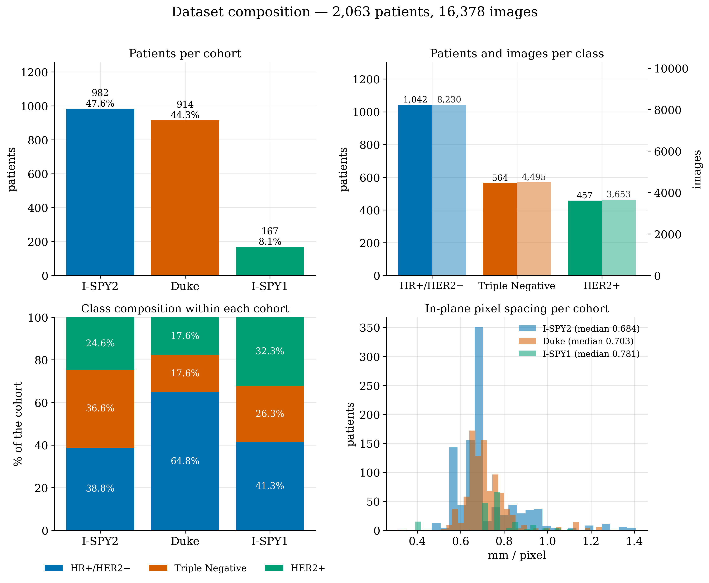
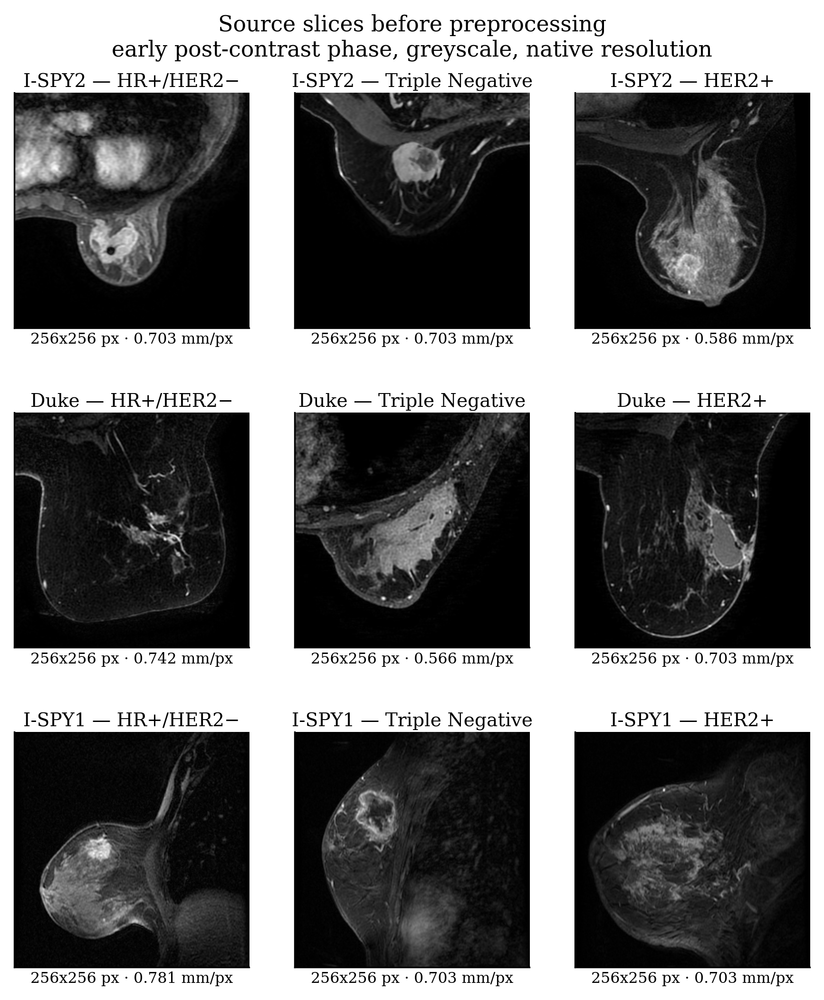
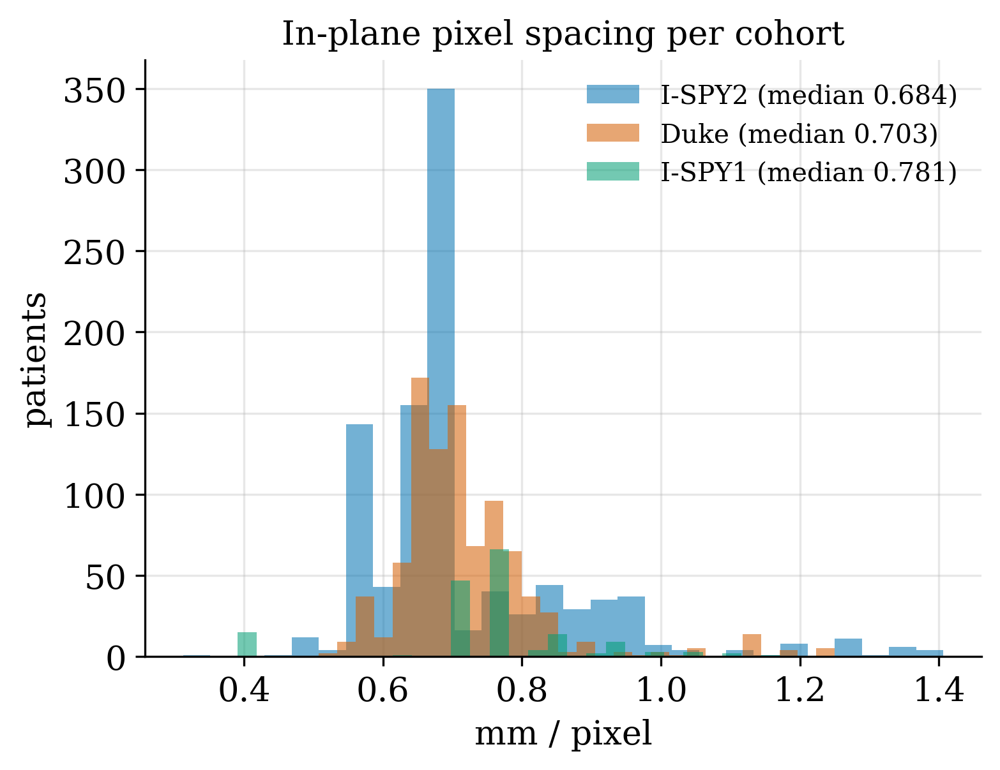

# Dataset documentation

How the processed dataset is organised, what every field means, and what the images look
like. For the reasoning behind each preprocessing choice see
[PREPROCESSING_AND_IMAGING.md](PREPROCESSING_AND_IMAGING.md); for
the full scientific characterisation see
[DATASET_REPORT.md](DATASET_REPORT.md).

---

## What it is

| | |
|---|---|
| **Name** | `multi_subtype_80mm` |
| **Location** | `dataset/multi_subtype_80mm/` |
| **Built from** | BreastDCEDL MinCrop — I-SPY2 + I-SPY1 + Duke |
| **Patients** | 2,063 |
| **Images** | 16,378 |
| **Format** | RGB PNG, 224 x 224, 8-bit |
| **Resolution** | 0.35714 mm/px, constant for every image |
| **Classes** | HR+/HER2−, TripleNeg, HER2+ |



---

## How it is organised

```
dataset/multi_subtype_80mm/
├── config.json          the exact build parameters
├── metadata.csv         16,378 rows x 35 columns — one row per image
├── train.csv            12,131 rows
├── val.csv               2,132 rows
├── test.csv              2,115 rows
└── images/
    └── <PID>/slice_XXX.png
```

`filename` in every CSV is `<PID>/slice_XXX.png`, relative to `images/`.

**The images are not in version control.** They are rebuilt by `build_dataset.ipynb` from
`raw_dataset_BreastDCEDL/`. The CSVs and `config.json` *are* tracked, because together
they define the dataset.

---

## What one image is

Each PNG is one axial slice through the tumour, and its three colour channels are three
different points in time:

| Channel | Acquisition |
|---|---|
| **R** | pre-contrast |
| **G** | early post-contrast |
| **B** | late post-contrast |

So the **colour** of a voxel encodes how it took up and released the contrast agent —
which is the diagnostic content of a DCE study. A voxel that brightens sharply and fades
is a different colour from one that brightens slowly and stays bright.

### Before and after

Source slices, as released — greyscale, native resolution, one phase:



The same patients after preprocessing. These are real files from `dataset/`:


### How one slice gets there


---

## The splits

Taken from the release's own `split` column, at **patient level**. Every slice of a
patient is in exactly one split.

| Split | Patients | Images | HR+/HER2− | TripleNeg | HER2+ | Trivial baseline |
|---|---:|---:|---:|---:|---:|---:|
| train | 1,527 | 12,131 | 773 | 410 | 344 | — |
| validation | 268 | 2,132 | 132 | 76 | 60 | 0.4925 |
| test | 268 | 2,115 | 137 | 78 | 53 | **0.5112** |

**The trivial baseline is the accuracy of always predicting the majority class.** No
accuracy figure in this project is quoted without it.

---

## The cohorts, and why they are not interchangeable

| Cohort | Patients | Images | Annotation | Study type |
|---|---:|---:|---|---|
| I-SPY2 | 982 | 7,835 | 3-D voxel mask | Multi-centre trial |
| Duke | 914 | 7,212 | **Bounding box only** | Single-institution clinical series |
| I-SPY1 | 167 | 1,331 | 3-D voxel mask | Multi-centre trial |

Class composition **within** each cohort:

| Cohort | HR+/HER2− | TripleNeg | HER2+ |
|---|---:|---:|---:|
| Duke | **64.8%** | 17.6% | 17.6% |
| I-SPY1 | 41.3% | 26.3% | 32.3% |
| I-SPY2 | 38.8% | 36.6% | 24.6% |

Duke is 26 percentage points richer in HR+/HER2− than I-SPY2, and its tumours are roughly
five times smaller by median volume. A classifier trained to predict *which cohort* an
image came from reaches macro-AUC **0.9978**. Any result measured on the pooled dataset
must be reported with that beside it.

---

## Why every image has the same resolution



Source in-plane spacing ranges from 0.312 to 1.406 mm/px — a 4.5-fold spread, and it
varies systematically by cohort. Cropping a fixed *number of pixels* would cover 70 mm of
anatomy for one patient and 315 mm for another, and the degree of magnification would
then identify the cohort by itself.

The crop is therefore a fixed **80 physical millimetres**, and the number of source pixels
it spans varies per patient. After the resize to 224, every image in the dataset sits at
0.35714 mm/px.

---

## metadata.csv — all 35 columns

One row per **image**, not per patient. Use `drop_duplicates("pid")` for patient-level
statistics, or patients with 8 slices count eight times.

### Identity and label

| Column | Meaning |
|---|---|
| `filename` | `<PID>/slice_XXX.png`, relative to `images/` |
| `pid` | Patient identifier — 2,063 unique |
| `cohort` | `spy1` · `spy2` · `duke` |
| `split` | `train` · `val` · `test` |
| `label` | 0, 1, 2 |
| `label_name` | `HRposHER2neg` · `TripleNeg` · `HER2pos` |

### Position within the lesion

| Column | Range | Meaning |
|---|---|---|
| `slice_index` | 1–127 | z index in the source volume |
| `slice_order` | 0–7 | Position among the 8 kept slices |
| `z_rel` | 0–1 | Relative position along the lesion |
| `n_slices_tumor` | 1–150 | Tumour-bearing slices the patient had **before** selection |

### Which DCE phases were actually read

| Column | Meaning |
|---|---|
| `phase_pre`, `phase_early`, `phase_late` | The acquisition index used for each channel |

Recorded so that a fallback substitution is never invisible: when a requested index is
missing, the last available acquisition is used and that index is written here.

### Tumour measurements

**`-1` means not computable and is never imputed.** It marks the Duke rows, which have no
voxel mask. Filter with `> 0` before averaging.

| Column | Meaning |
|---|---|
| `roi_source` | `mask` (1,149 patients) or `bbox` (914 patients) |
| `roi_basis` | How the in-plane box was derived |
| `tumor_pixels`, `tumor_area_mm2`, `tumor_fraction` | Tumour extent within the saved frame |

### Geometry

| Column | Meaning |
|---|---|
| `bbox_x/y/w/h` | Tumour box in the final 224x224 image. Negative values are legitimate — the tumour extends past the window edge, which is why cropping zero-pads |
| `box3d_row0/row1/col0/col1` | Tumour box in the source volume |
| `crop_center_row/col` | Centre of the 80 mm window in the source volume |

### Acquisition and preprocessing

| Column | Range | Meaning |
|---|---|---|
| `xy_spacing` | 0.3125–1.4062 | Source in-plane spacing, mm/px |
| `slice_thick` | 0.8–4.0 | Slice thickness, mm |
| `crop_mm` | 80.0 constant | The physical window |
| `crop_px` | 57–256 | That window in source pixels |
| `img_size` | 224 constant | Output size |
| `mm_per_px` | 0.35714 constant | Final resolution |
| `tum_vol` | −1, 0–495 | Tumour volume from the source metadata |

Those last three columns carry the whole argument: `xy_spacing` varies 4.5-fold,
`crop_px` follows it from 57 to 256, and `mm_per_px` comes out constant for all 16,378
rows.

---

## config.json — the build parameters

```json
{"n_slices": 8, "trim_frac": 0.15, "crop_mm": 80.0, "save_size": 224,
 "normalization": "minmax", "chanclip_q": 0.98, "min_tumor_px": 10,
 "roi_basis": "area_max", "cohorts": ["spy2","spy1","duke"],
 "n_patients": 2063, "n_images": 16378, "errors": {}}
```

Slices per patient: mean 7.94, median 8, range 1–8. Fifty-one patients have fewer than
eight, because they had fewer tumour-bearing slices after the 15% trim.

---

## Rebuilding it

```bash
jupyter notebook build_dataset.ipynb
```

Needs `raw_dataset_BreastDCEDL/` — see [its README](../raw_dataset_BreastDCEDL/README.md).
The builder refuses to finish if any patient appears in two splits, if a patient has more
than one label, if a filename is duplicated, or if any listed file is missing from disk.

## Checking it

```bash
python src/scripts/audit_dataset.py
```
