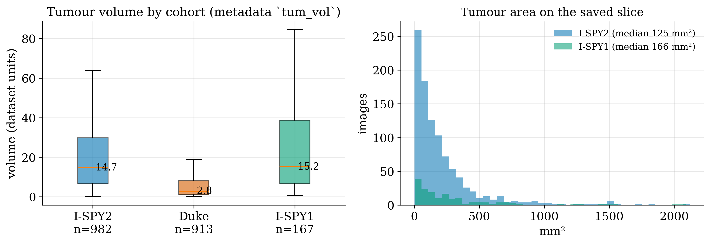
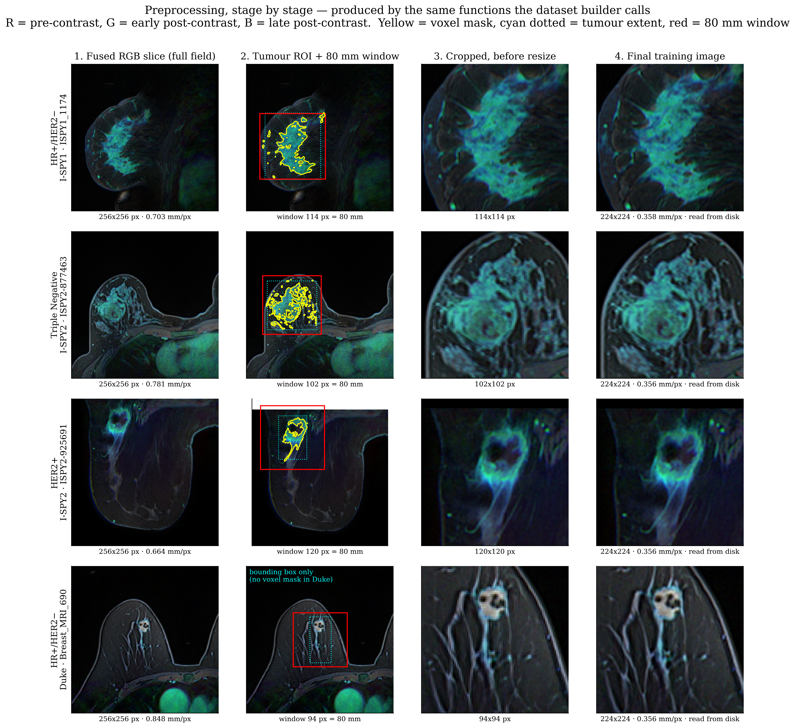

# Dataset and Preprocessing — Scientific Report

**Breast-cancer molecular-subtype classification from DCE-MRI**
Combined I-SPY1 + I-SPY2 + Duke cohorts, BreastDCEDL MinCrop release

---

## How to read this report

Three kinds of statement appear here and they are never mixed:

| marker | meaning |
|---|---|
| **[PAPER]** | Reported by the original dataset publication or a cited paper. |
| **[OURS]** | A decision made in this project, or a number computed from our data. |
| **[MEASURED]** | A conclusion from our own experiments, with the measurement. |
| **[UNCONFIRMED]** | Could not be verified from the code, the data or the papers available. Stated as unknown rather than guessed. |

Every table of counts in this report was computed directly from
`data/multi_subtype_80mm/metadata.csv` and the BreastDCEDL metadata CSV. Every
figure is regenerated by `scripts/build_dataset_report_figures.py` from the same
files and from the source NIfTI volumes, so a figure and a table cannot disagree.

---

## 1. Dataset overview

### 1.1 Provenance

**[PAPER]** BreastDCEDL is a curated, deep-learning-ready dataset of pre-treatment
3D DCE-MRI from **2,070 breast-cancer patients**, drawn from three cohorts held by
The Cancer Imaging Archive: I-SPY1, I-SPY2 and Duke. DICOM data were converted to
standardised 3D NIfTI volumes with unified tumour annotations and harmonised
clinical metadata including pCR, hormone-receptor (HR) and HER2 status
([Fridman et al., *Scientific Data* 13, 264, 2026](https://www.nature.com/articles/s41597-026-06589-6);
preprint [arXiv:2506.12190](https://arxiv.org/abs/2506.12190)).

**[PAPER]** Cohort sizes and their exclusions, as reported by the authors:

| cohort | included | of enrolled | reason for exclusion |
|---|---:|---:|---|
| I-SPY1 | 172 | 221 | only 172 had ≥3 scans |
| I-SPY2 | 982 | 985 | 3 excluded for missing clinical data |
| Duke | 916 | 922 | 6 excluded for missing DCE data |
| **total** | **2,070** | | |

### 1.2 Cohort origins

**[PAPER]** **I-SPY1 / ACRIN 6657** enrolled 237 women between May 2002 and March
2006; 230 met eligibility for locally advanced breast cancer with stage T3 primary
tumours of at least 3 cm. Pre-operative DCE-MRI for 222 women is publicly available
through TCIA
([TCIA ISPY1 collection](https://www.cancerimagingarchive.net/collection/ispy1/);
[Chitalia et al., expert tumour annotations for ACRIN 6657/I-SPY1](https://www.ncbi.nlm.nih.gov/pmc/articles/PMC9308769/)).

**[PAPER]** **I-SPY2** is an adaptive neoadjuvant trial. The TCIA collection holds
719 patients which, combined with 266 from ACRIN 6698/I-SPY2, form "I-SPY2 Imaging
Cohort 1"; subjects were enrolled from 2010 to 2016 and randomised to experimental
or control arms
([TCIA ISPY2 collection](https://www.cancerimagingarchive.net/collection/ispy2/)).

**[PAPER]** **Duke-Breast-Cancer-MRI** is a single-institution retrospective
collection of 922 biopsy-confirmed invasive breast cancers from Duke Hospital,
accrued 1 January 2000 – 23 March 2014, described in
[Saha et al., *British Journal of Cancer* 119, 508–516 (2018)](https://www.cancerimagingarchive.net/collection/duke-breast-cancer-mri/).

**[OURS]** The three cohorts are therefore **not interchangeable**: two are
multi-centre neoadjuvant *trials* with eligibility criteria favouring large
tumours, and one is a single-institution *clinical* series spanning fourteen years.
This is the origin of the differences quantified in §2.

### 1.3 Annotations

**[PAPER]** The two annotation regimes differ fundamentally:

- **I-SPY1 and I-SPY2** — "We converted these analysis masks into binary 3D files,
  coding tumor regions as 1 and background tissue as 0." A **voxel-level 3D mask**.
- **Duke** — "Expert radiologists annotated bounding boxes on planes containing the
  largest tumor area." The authors "transformed these bounding box coordinates to
  correspond with our standardized DCE-MRI alignment." A **bounding box**, not a
  segmentation.
- **All cohorts** — "only the largest (primary) tumor was annotated."

**[OURS]** This is the single largest methodological asymmetry between the cohorts
and it propagates into our pipeline (§5.4). It is visible in Figure 4, row 4.

### 1.4 Imaging characteristics

**[UNCONFIRMED]** The BreastDCEDL paper **does not specify** field strength,
pulse-sequence names, or nominal spatial resolution. It states only that the
conversion preserved "the integrity of the signal" and "original DICOM acquisition
parameters". **We therefore do not report field strength or sequence for any
cohort**, because no source available to us states them.

**[OURS]** What we *can* report is measured from the released volumes themselves:

| cohort | in-plane spacing, median (min–max) | slice thickness, median | ROI type |
|---|---|---:|---|
| I-SPY2 | **0.684 mm** (0.312 – 1.406) | 2.00 mm | voxel mask |
| Duke | **0.703 mm** (0.508 – 1.250) | 2.00 mm | bounding box |
| I-SPY1 | **0.781 mm** (0.391 – 1.172) | 2.30 mm | voxel mask |

The **4.5-fold range in in-plane spacing** (0.312 – 1.406 mm/px) across the
combined dataset is the single most important number for the preprocessing design,
and is the reason the crop is defined in millimetres rather than pixels (§5.6).

### 1.5 Clinical and molecular labels

**[PAPER]** The release includes HR status, HER2 status and pCR. **The receptor
definitions are not harmonised across cohorts** — the paper states them explicitly:

| marker | I-SPY1 | I-SPY2 | Duke |
|---|---|---|---|
| HR positive | ≥10% staining | ≥1% staining | Allred score > 3 |
| HER2 positive | FISH ratio ≥ 2.0 | FISH ratio ≥ 2.0 | FISH ratio > 2.2 |

**[OURS]** This matters for our task and is stated here rather than buried: the
class label itself is defined slightly differently in each cohort. A patient near
the HR threshold could be labelled positive in I-SPY2 and negative in I-SPY1. We
did not attempt to re-harmonise the thresholds — doing so would require the
underlying staining percentages, which the release does not expose. **This is a
limitation of the combined-cohort design, not a defect in our pipeline.**

**[OURS]** The three-class target `HR_HER2_STATUS` is a **native column of the
BreastDCEDL metadata**, not something we derived. Verified: the column exists in
`BreastDCEDL_metadata_min_crop.csv` with values `HRposHER2neg`, `TripleNeg`,
`HER2pos`.

---

## 2. Cohort comparison — the differences that matter


*Figure 1. Composition of the combined dataset. Bottom-left is the panel to read
first: the class mix differs sharply between cohorts.*

**[OURS]** Class composition **within** each cohort, in patients:

| cohort | HR+/HER2− | Triple Negative | HER2+ |
|---|---:|---:|---:|
| Duke | **64.8%** | 17.6% | 17.6% |
| I-SPY1 | 41.3% | 26.3% | 32.3% |
| I-SPY2 | 38.8% | 36.6% | 24.6% |

Duke is **26 percentage points** richer in HR+/HER2− than I-SPY2. This is
consistent with the cohort origins (§1.2): a screening-era clinical series contains
more early, hormone-receptor-positive disease than a neoadjuvant trial that
enrolled locally advanced tumours.



*Figure 2. Tumour burden by cohort. Left: volume from the metadata. Right: tumour
area on the saved slice — Duke is absent because it has no voxel mask, so area
cannot be computed (never imputed).*

### 2.1 The source-signature confound — [MEASURED]

**[MEASURED]** A ResNet-18 trained to predict **which cohort** a slice came from,
using the same preprocessing and the same architecture as the subtype task, reached
**macro-AUC 0.9978**. The same architecture on the actual subtype task reached
**0.6078**.

**[OURS]** The interpretation is direct: cohort identity is almost perfectly
recoverable from the images, and cohort identity is strongly correlated with the
label (Duke 64.8% HR+/HER2− vs I-SPY2 38.8%). A model can therefore reach a
respectable subtype AUC by learning *scanner and protocol*, not biology. The
shortcut is available as "small tumour → probably Duke → probably HR+/HER2−".

**[OURS]** This does not invalidate the combined dataset, but it does constrain
what may be claimed from it, and it must be reported beside any result measured
here. It is also why several preprocessing choices below are explicitly designed
to avoid *adding* cohort-identifying signal (§5.6, §5.3).

---

## 3. Final dataset composition

### 3.1 Inclusion and exclusion — [OURS]

| step | patients | lost | reason |
|---|---:|---:|---|
| 1. BreastDCEDL MinCrop metadata | 2,072 | — | as released |
| 2. with a `HR_HER2_STATUS` label | 2,067 | 5 | label missing (all I-SPY1) |
| 3. built successfully | **2,063** | 4 | **no DCE files on disk** (all Duke) |

**[OURS]** The four excluded Duke patients are `Breast_MRI_700`, `Breast_MRI_728`,
`Breast_MRI_801`, `Breast_MRI_893`. Verified individually: each has a valid
bounding box and `n_xy = 256`, and **zero `*_dce_aqc_*.nii.gz` files** in the
downloaded release. The exclusion is missing imaging, not a pipeline rejection.

**[UNCONFIRMED]** Two numbers do not reconcile and we state that rather than paper
over it. The BreastDCEDL **paper** reports **916** Duke patients; the released
**metadata CSV** contains **918** Duke rows. We could not determine from the
available sources which is authoritative or what the two extra rows represent. Our
count of 914 built patients is consistent with 918 rows minus the 4 with no
imaging.

### 3.2 Final composition — [OURS]

**2,063 patients · 16,378 images · 3 classes**

Patients by cohort and class:

| cohort | HR+/HER2− | Triple Negative | HER2+ | **total** |
|---|---:|---:|---:|---:|
| I-SPY2 | 381 | 359 | 242 | **982** |
| Duke | 592 | 161 | 161 | **914** |
| I-SPY1 | 69 | 44 | 54 | **167** |
| **total** | **1,042** | **564** | **457** | **2,063** |

Images by cohort and class:

| cohort | HR+/HER2− | Triple Negative | HER2+ | **total** |
|---|---:|---:|---:|---:|
| I-SPY2 | 3,036 | 2,864 | 1,935 | **7,835** |
| Duke | 4,644 | 1,282 | 1,286 | **7,212** |
| I-SPY1 | 550 | 349 | 432 | **1,331** |
| **total** | **8,230** | **4,495** | **3,653** | **16,378** |

**[OURS]** Images per patient: mean 7.94, median 8, range 1–8. The maximum is 8 by
construction (§5.5); patients below 8 had fewer tumour-bearing slices than that.

### 3.3 Splits — [OURS]

The split is taken from the **`split` column of the BreastDCEDL metadata**
(`0 = train, 1 = test, 2 = val`), not re-derived. Patients, by class:

| split | HR+/HER2− | Triple Negative | HER2+ | total | majority-class share |
|---|---:|---:|---:|---:|---:|
| train | 773 | 410 | 344 | **1,527** | — |
| validation | 132 | 76 | 60 | **268** | 0.4925 |
| test | 137 | 78 | 53 | **268** | **0.5112** |

By cohort:

| split | Duke | I-SPY1 | I-SPY2 | total |
|---|---:|---:|---:|---:|
| train | 642 | 101 | 784 | 1,527 |
| validation | 136 | 33 | 99 | 268 |
| test | 136 | 33 | 99 | 268 |

**[OURS]** The **trivial baseline of the test set is 0.5112** — the accuracy of
always predicting HR+/HER2−. Accuracy is meaningless without it and it is reported
beside every accuracy in this project.

**[OURS]** Note the split is **not** the one the BreastDCEDL paper describes
(1,099 / 177 / 176). That partition is defined over the pCR-labelled subset; ours
covers the subtype-labelled subset. The `split` column is the same; the subset
differs.

---

## 4. Class definitions and why these three

### 4.1 The classes

| index | class | receptor status |
|---|---|---|
| 0 | **HR+/HER2−** (`HRposHER2neg`) | hormone-receptor positive, HER2 negative |
| 1 | **Triple Negative** (`TripleNeg`) | HR negative and HER2 negative |
| 2 | **HER2+** (`HER2pos`) | HER2 positive (any HR) |

### 4.2 Clinical rationale — [PAPER]

**[PAPER]** Receptor-defined subgroups differ materially in prognosis and in
treatment. Luminal (HR+/HER2−) disease carries the best prognosis, followed by
HR+/HER2+, triple-negative and HER2-enriched tumours; all subtypes compared with
Luminal A are significantly associated with worse progression-free survival
([Clinical implications of intrinsic molecular subtypes, *The Breast*, 2022](https://www.sciencedirect.com/science/article/pii/S0305737222001724);
[Deciphering HER2 Breast Cancer Disease, *Front. Oncol.* 9:1124, 2019](https://www.frontiersin.org/journals/oncology/articles/10.3389/fonc.2019.01124/full)).

**[PAPER]** HER2 status is scored under the
[2018 ASCO/CAP guideline](https://www.ncbi.nlm.nih.gov/pmc/articles/PMC8742337/),
which is the standard the cohort definitions in §1.5 refer to.

**[OURS]** These three groups are the ones that **change management**: HR+/HER2−
receives endocrine therapy, HER2+ receives HER2-targeted agents, and triple-negative
has neither target and is treated with chemotherapy. Predicting them from imaging
is therefore clinically meaningful in a way that predicting an arbitrary partition
would not be.

### 4.3 Why not Luminal A vs Luminal B — [OURS]

**[OURS]** Luminal A and Luminal B are separated principally by **Ki-67
proliferation index**, which has no established imaging correlate and is not
released with these cohorts. An earlier iteration of this project attempted a
four-class split including Luminal A/B and found the distinction was **~90% carried
by cohort identity** rather than biology — Duke contributes only 3 Luminal B
patients in total. The three receptor-defined classes above are what the data can
actually support.

---

## 5. Preprocessing methodology

Everything in this section was read from
`core/dataset_builder.py` and `pipelines/thesis/preprocessing.py`. Parameters are
those recorded in the built dataset's own `config.json`:

```json
{"cohorts": ["spy2","spy1","duke"], "crop_mm": 80.0, "n_slices": 8,
 "trim_frac": 0.15, "min_tumor_px": 10, "normalization": "minmax",
 "chanclip_q": 0.98, "roi_basis": "area_max", "save_size": 224,
 "n_patients": 2063, "n_images": 16378, "errors": {}}
```



*Figure 4. The four stages, produced by the same functions the builder calls. Rows
1–3: one patient per class from a mask cohort. Row 4: Duke, where the ROI is a
bounding box and no voxel mask exists. Yellow = mask contour, cyan dotted = tumour
extent, red = the 80 mm window.*

### 5.1 NIfTI loading — [OURS]

Each phase volume is read with `nibabel` as `float32` and passed through
`np.nan_to_num(nan=0.0, posinf=0.0, neginf=0.0)`.

**Why:** a single NaN propagates through normalisation and turns an entire patient
into NaN silently. Replacing with zero is the conservative choice — a zero voxel is
background, which is what a non-finite voxel in air almost always is.

**Alternative not taken:** dropping affected patients. Rejected because it would
discard whole cases for a handful of voxels.

### 5.2 DCE phase selection and channel construction — [OURS] following [PAPER]

Three phases are read per patient, indexed by the metadata columns `pre`,
`post_early`, `post_late`, and stacked into a `(3, Z, Y, X)` array. **R =
pre-contrast, G = early post-contrast, B = late post-contrast.**

**[PAPER]** This is exactly the authors' fusion: "Pre-contrast, early post-contrast,
and late post-contrast acquisitions assigned to the red, green, and blue channels,
respectively", motivated by enabling "pre-trained models" to be used on what is
natively 4D temporal data.

**Why we kept it:** the three-channel layout is what makes ImageNet pretraining
usable at all, and the temporal ordering means the *colour* of a voxel encodes its
enhancement kinetics — the wash-in/wash-out behaviour that is the diagnostic content
of a DCE study. A grayscale slice repeated three times would discard it.

**[OURS] Fallback rule:** when a requested phase index is absent, the **last
available acquisition** is substituted, and the index actually used is written into
the CSV (`phase_pre`, `phase_early`, `phase_late`) so no substitution is invisible.
This follows the authors' own specification for Duke ("timepoints 0, 1, and the
final acquisition").

**Guard:** if the three phases do not share a shape, the patient is rejected rather
than resampled to match.

### 5.3 Intensity normalisation — [OURS], deviating from [PAPER]

**Applied to the whole 4D volume before any cropping**: min–max over all phases and
all slices jointly.

```
lo, hi = nanmin(volume), nanmax(volume)
volume = clip((volume - lo) / (hi - lo), 0, 1)
```

**[PAPER]** The authors state "All images underwent Min-Max normalization and
conversion to 8-bit format", applied **per slice**.

**[OURS] Why we normalise over the volume instead:** per-slice normalisation
destroys the intensity relationship *between* slices and *between* phases. An
almost-empty slice is rescaled to the same brightness as one containing an intensely
enhancing lesion, and the enhancement ratio between pre- and post-contrast — the
biological signal — is removed. Volume-level normalisation preserves both.

**Alternative available and measured:** `normalize_channel_clip`, which clips each
phase at its own 98th percentile before scaling.

**[PAPER]** This was the *winning* strategy in the authors' own later benchmark of
seven normalisations ([arXiv:2510.13897](https://arxiv.org/abs/2510.13897)):
per-channel clipping at q0.98 gave AUC 0.744 against 0.700 for global min–max —
their worst.

**[MEASURED] It lost here.** On our 3-class subtype task with two seeds, channel
clipping scored **0.5830** against **0.6078** for global min–max — the opposite
direction, though inside our noise floor. Their result was for binary HER2 on their
preprocessing and did not transfer. **Kept available, not default.** This is a case
where we did not follow the literature, and the measurement is the reason.

### 5.4 ROI localisation — [OURS], constrained by [PAPER]

**Mask cohorts (I-SPY1, I-SPY2):** the 3D binary mask is reduced to per-slice
areas; slices with ≥ `min_tumor_px` (10) tumour pixels define the z-extent. The
in-plane box is taken from **the single slice with the largest tumour area**.

**Why the largest-area slice and not the 3D union:** because that is what the Duke
annotation *is* — a box drawn on the plane with the largest tumour area (§1.3).
Using the 3D union for I-SPY and a single plane for Duke would introduce a
systematic, cohort-specific difference in framing. Given the 0.9978 source probe
(§2.1), a cohort-specific difference is the most expensive error available.
**[OURS]** The two centres differ by 2.3 mm at the median and up to 25.6 mm in the
tail.

**Box cohort (Duke):** the box comes from the metadata columns `sraw/eraw/scol/ecol`.
The z-extent is **not** taken from `mask_start/mask_end` — those index the *original*
volume, while MinCrop is already cropped in z. It is derived from the MinCrop
construction rule (tumour range plus two slices of margin per side), so the tumour
occupies `z ∈ [2, nz−3]`.

**Guard:** patients whose `n_xy ≠ 256` are rejected because the box coordinates do
not map. **[OURS]** In the current release all 918 Duke rows have `n_xy = 256`, so
this guard excluded nobody; the 4 losses were missing imaging (§3.1).

**[OURS] Verification:** the box construction was validated against real masks on
I-SPY2, where both exist — it matched for 767 of 767 patients whose original scan
was already 256×256.

### 5.5 Slice selection — [OURS]

Trim 15% of the lesion's z-extent from **each** end, then take **8 evenly spaced
slices** by `linspace` over what remains. Patients with fewer than 8 keep all of
them.

**Why trim proportionally, not absolutely:** a tumour spanning 60 slices loses 9 per
end; one spanning 8 loses 1. An absolute rule ("drop 3") would erase half of a small
tumour. The trim is *geometric*, so it behaves identically with a mask or a box —
again avoiding a cohort-specific difference.

**Why spread rather than the N central slices:** neighbouring slices 1–2 mm apart are
near-duplicates and contribute nearly the same gradient. Spreading covers the lesion
end to end for the same number of images.

**[OURS] Effect:** the previous behaviour kept *every* tumour-bearing slice — a mean
of 38 per patient, maximum 150, with 21% carrying fewer than 100 tumour pixels. Two
harms followed: the per-patient mean that produces the final prediction was diluted
by near-empty slices, and a patient with 150 slices contributed 150 gradient samples
against another's 8. Eight spread slices reduce **63,460 tumour slices to 16,378
images (25.8%)**.

### 5.6 Tumour-centred cropping and the physical window — [OURS]

A **square window of 80 physical millimetres**, centred on the ROI box centre:

```
side_px = max(round(80.0 / xy_spacing), 8)
```

The window may extend beyond the image; the caller **zero-pads** rather than
shrinking. Shrinking would change the scale for peripheral tumours only, and
constant scale is the entire point.


*Figure 5. Left: the resampling factor is similar across cohorts, so magnification
does not encode the source. Right: the tumour's share of the frame varies — which
is the information a proportional crop would destroy.*

#### Why not simply resize the tumour to fill the frame?

**[OURS]** This is the central preprocessing decision and it deserves the space.

A margin expressed as "15–20% of the bounding box" — the common choice — makes the
lesion fill the frame **identically in every patient**. In doing so it **erases
tumour size**. Two consequences:

1. **Tumour size is predictive here.** [MEASURED] Size alone is worth macro-AUC
   0.58–0.68 on this task, and it ranks as the most important predictor in the
   BreastDCEDL authors' own feature-importance analysis. A proportional crop throws
   that away before the network sees anything.
2. **Size is biology.** Tumour extent is part of staging and correlates with
   subtype: the cohorts differ 5-fold in median tumour volume (Figure 2). An 80 mm
   frame keeps it — a 60 mm tumour occupies nine times the frame area of a 20 mm
   one, as in reality.

#### Why in millimetres rather than pixels?

**[OURS]** Because `xy_spacing` ranges from **0.312 to 1.406 mm/px** (§1.4). A fixed
224-pixel crop would cover 70 mm for one patient and 315 mm for another — the
*field of view* would then vary by cohort, and the degree of magnification would
itself identify the source. After the physical window and the resize, every image
sits at a nearly constant **≈0.357 mm/px**.

**[OURS] Measured effect:** the resampling factor became 1.96× (Duke), 1.91×
(I-SPY2), 2.20× (I-SPY1) — similar across cohorts — against roughly 4× versus 2×
for a proportional crop.

#### Why 80 mm specifically?

**[OURS]** It is the smallest window containing the whole tumour for the **median
patient of all three cohorts** (I-SPY1 64.8 mm, I-SPY2 61.2 mm, Duke 29.2 mm), plus
roughly 7 mm of peritumoral tissue per side — within the 4–6 mm margin reported as
optimal in the peritumoral-radiomics literature. It fully contains the lesion in
**81% of patients**.

#### Honest caveat — [MEASURED]

**[MEASURED]** On the same 99 I-SPY2 test patients, this preprocessing scored
**0.5837 ± 0.011** against **0.6201 ± 0.024** for the older pipeline. The difference
is inside the 0.067 noise floor, so the verdict is *"no difference detected"* — but
it is **not** the improvement that was expected. What it did buy is a
validation-to-test gap of **+0.015** against **+0.073**, i.e. a result that
generalises more honestly.

### 5.7 8-bit conversion, resize and output — [OURS] following [PAPER]

In order:

1. **Crop** the normalised plane to the window, zero-padding outside.
2. **8-bit**: `(clip(plane, 0, 1) * 255).astype(uint8)`, transposed to H×W×C.
3. **Resize** to **224×224** with **PIL LANCZOS**, only if the window side ≠ 224.
4. **Save** as RGB PNG with `optimize=True`.

**[PAPER]** 8-bit conversion follows the authors ("conversion to 8-bit format").

**[OURS] Why 224×224:** it is the native input size of ImageNet-pretrained
torchvision backbones, so no interpolation happens inside the network.

**[OURS] Why LANCZOS:** it is the highest-quality resampling filter PIL offers for
downscaling, which is the direction almost every image travels here (windows are
typically 102–120 px upscaled to 224, or larger windows downscaled).

**[UNCONFIRMED]** We did not benchmark LANCZOS against bilinear or bicubic on this
task. The choice is defensible on general grounds but is **not** supported by a
measurement of ours.

**[OURS] Order matters and is deliberate:** normalisation happens on the **whole
volume before cropping** (§5.3), so the intensity scale is a property of the patient
and not of the window. Normalising after cropping would make brightness depend on
how much background the window happened to include.

### 5.8 Data augmentation — [OURS]

**Not part of dataset construction.** The PNGs on disk are unaugmented. Augmentation
is applied at training time, to the training split only, by the loader. The
configured profile is `augmentation: "default"`.

**[MEASURED]** A reduced profile ("half" — same amplitudes, applied 50% of the time)
was measured and **lost**: it tripled the train/test gap (0.135 → 0.512) and cost
0.040 macro-AUC. The default profile is what holds this model back from memorising.

**[UNCONFIRMED]** The exact transform list and amplitudes live in the training
loader rather than in the preprocessing pipeline, and are **not** documented in this
report. They are outside the "original images → final images" scope this report
covers.

### 5.9 What we did NOT do — [OURS]

Stated explicitly so their absence is not mistaken for an oversight:

- **No bias-field / N4 correction.** The release is already standardised and we did
  not add a step whose effect we could not measure.
- **No skull/chest-wall stripping or breast segmentation.** The 80 mm tumour-centred
  window makes it largely unnecessary.
- **No registration between phases.** The three phases are assumed co-registered as
  released; we only verify their shapes match.
- **No z-resampling.** Slice thickness (2.0–2.3 mm median) is left as acquired; only
  the in-plane scale is harmonised.
- **No inter-cohort intensity harmonisation** (e.g. ComBat). **[OURS]** This is a
  real limitation given the 0.9978 source probe, and a clear candidate for future
  work.

---

## 6. Visual examples


*Figure 3. Final 224×224 training images — one random patient per cohort and class,
labelled with cohort, class and the source pixel spacing. These are the actual files
the network reads.*

---

## 7. Why this dataset, and why these three cohorts combined

**[OURS]** The reasoning, in order:

1. **BreastDCEDL is standardised and deep-learning-ready.** It removes the DICOM
   conversion, annotation harmonisation and metadata cleaning that would otherwise
   consume most of a thesis, and it comes with a paper to compare against.
2. **The combination is what makes the federated question meaningful.** This project
   is about federated learning across hospitals. Three cohorts from three different
   sources, with genuinely different class distributions and tumour sizes, are a
   far better model of "different hospitals" than one cohort split at random.
3. **Sample size.** 2,063 patients versus 982 for I-SPY2 alone — a 2.1× increase.

**[OURS] Against this stands the confound of §2.1**, and the honest position is that
both are true: the combination is more realistic *and* more confounded. Our
mitigation is to report the source probe beside every result rather than to pretend
the effect is absent.

**[MEASURED] The alternative was tried.** A single-cohort dataset (I-SPY2 only, 982
patients) was built and used for an earlier phase of experiments. It removes the
confound entirely, at the cost of half the data and of any realistic heterogeneity
between sites.

---

## 8. Summary — how the final dataset was constructed

Starting from 2,072 rows of BreastDCEDL MinCrop metadata:

1. Keep patients with a `HR_HER2_STATUS` label → **2,067**.
2. For each, load three DCE phases (pre, early post, late post) as NIfTI, replace
   non-finite voxels with zero, stack to `(3, Z, Y, X)`.
3. Locate the tumour: voxel mask for I-SPY1/I-SPY2 (largest-area plane defines the
   in-plane box), metadata bounding box for Duke.
4. **Min–max normalise the whole 4D volume** (all phases, all slices jointly).
5. Trim 15% from each end of the lesion's z-extent and take **8 evenly spaced
   slices**.
6. Crop a square **80 mm physical window** centred on the tumour, zero-padded.
7. Convert to 8-bit, resize to **224×224** with LANCZOS, save as RGB PNG.
8. 4 Duke patients fail at step 2 for missing imaging → **2,063 patients,
   16,378 images**.

The result is a dataset in which every image is at a nearly constant **0.357 mm per
pixel**, tumour size is preserved as a real visual feature, enhancement kinetics are
preserved as colour, and the framing rule is identical for a segmentation mask and
for a bounding box.

---

## 9. References

1. Fridman, N., Solway, B., Fridman, T. et al. **BreastDCEDL: A standardized deep
   learning-ready breast DCE-MRI dataset of 2,070 patients.** *Scientific Data*
   **13**, 264 (2026). https://www.nature.com/articles/s41597-026-06589-6 ·
   preprint https://arxiv.org/abs/2506.12190
2. Fridman, N. et al. **THDA-ResNet / normalisation benchmark.**
   https://arxiv.org/abs/2510.13897
3. Saha, A. et al. **A machine learning approach to radiogenomics of breast cancer:
   a study of 922 subjects and 529 DCE-MRI features.** *British Journal of Cancer*
   **119**, 508–516 (2018). Collection:
   https://www.cancerimagingarchive.net/collection/duke-breast-cancer-mri/
4. **ACRIN 6657 / I-SPY1 TRIAL** collection and expert tumour annotations.
   https://www.ncbi.nlm.nih.gov/pmc/articles/PMC9308769/ ·
   https://www.cancerimagingarchive.net/collection/ispy1/
5. **I-SPY2 TRIAL** imaging collection.
   https://www.cancerimagingarchive.net/collection/ispy2/
6. **Clinical implications of the intrinsic molecular subtypes in hormone
   receptor-positive and HER2-negative breast cancer.** *The Breast* (2022).
   https://www.sciencedirect.com/science/article/pii/S0305737222001724
7. **Deciphering HER2 Breast Cancer Disease: Biological and Clinical Implications.**
   *Frontiers in Oncology* **9**:1124 (2019).
   https://www.frontiersin.org/journals/oncology/articles/10.3389/fonc.2019.01124/full
8. **2018 ASCO/CAP HER2 testing guideline**, as applied in
   https://www.ncbi.nlm.nih.gov/pmc/articles/PMC8742337/

---

## Appendix — reproducibility note

**[OURS]** `config.py::COHORT_DIRS` points at `BreastDCEDL/`, which holds the
metadata CSV but **not** the imaging volumes; those are under
`raw_dataset_BreastDCEDL/`. The dataset was built when the volumes were reachable at
the configured path and they are not reachable there now.
`scripts/build_dataset_report_figures.py` resolves both locations so the figures can
be regenerated, but **the builder's configured path is stale** and would fail if the
dataset had to be rebuilt today. Recorded here rather than silently patched: a path
that no longer resolves is a reproducibility defect.

Regenerate every figure in this report with:

```bash
python3 scripts/build_dataset_report_figures.py
```
