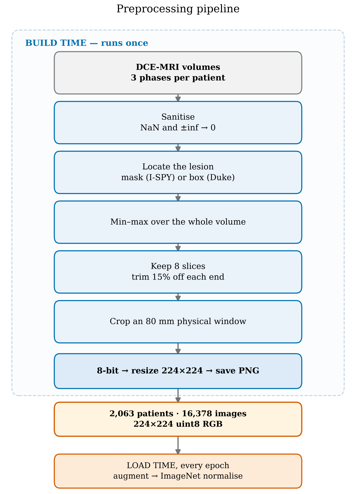
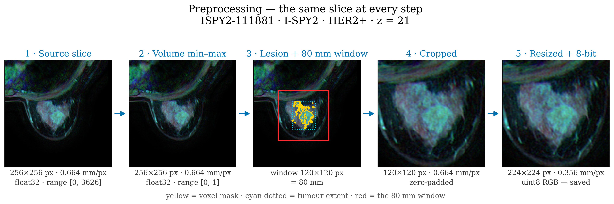
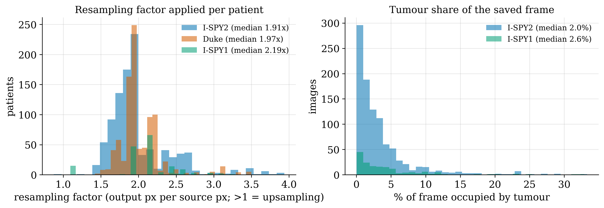
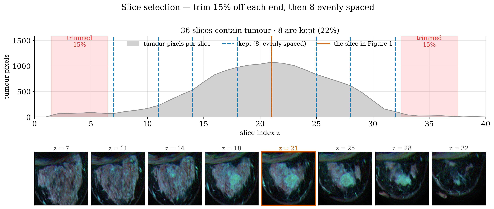
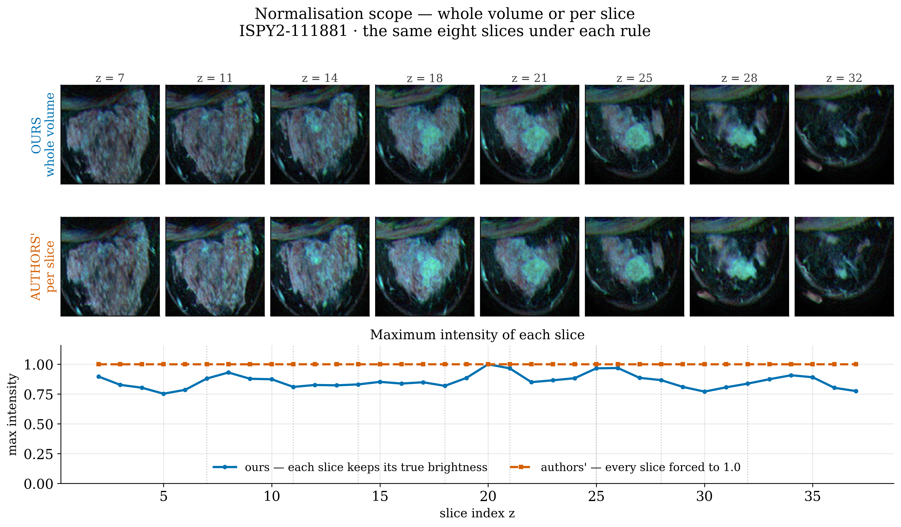
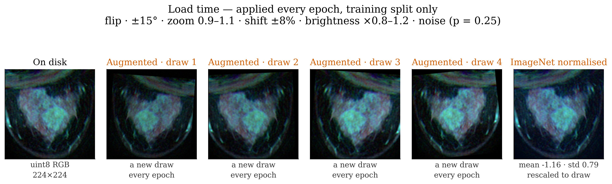
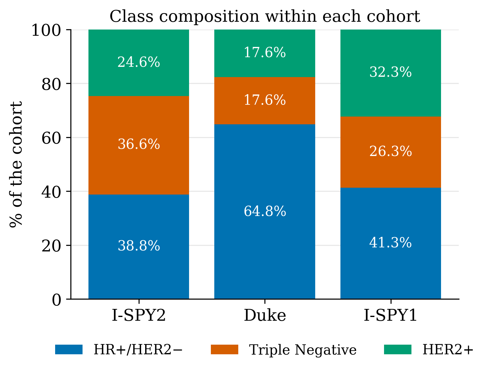

# Preprocessing and Imaging

Breast DCE-MRI, what this project does to it, and what went wrong along the way.

Companion documents: [PREPROCESSING.md](PREPROCESSING.md) is the step-by-step technical
reference; [DATASET_REPORT.md](DATASET_REPORT.md) characterises the resulting dataset.
This document explains the imaging background and the reasoning.

---

## 1. What a DCE-MRI study is, and why it suits this task

Dynamic contrast-enhanced MRI acquires the same volume repeatedly: once before a
gadolinium contrast agent is injected, then several times after. Tumour vasculature is
leaky and disorganised, so malignant tissue takes up contrast quickly and washes it out
quickly, while normal fibroglandular tissue enhances slowly and steadily. The
*diagnostic content of a DCE study is therefore not any single image but the change
between them.*

That property shapes the whole preprocessing design. Three acquisition time-points —
pre-contrast, early post-contrast and late post-contrast — are fused into the three
colour channels of one RGB image, so the **colour** of a voxel encodes its enhancement
kinetics. A voxel that brightens sharply and fades is a different colour from one that
brightens slowly and stays bright.

This channel assignment is the dataset authors' own, adopted here unchanged
(Fridman et al., 2026, <https://doi.org/10.1038/s41597-026-06589-6>). It also makes
ImageNet pretraining usable on data that is natively four-dimensional, which matters
when the labelled sample is small.

**Measured, and kept anyway:** against replicating a single greyscale phase across three
channels, RGB fusion scored 0.024 macro-AUC *lower*. The difference is well inside the
noise floor, and the fused representation is what makes the channels mean something, so
it stayed.

## 2. Molecular subtype, and why three classes

Receptor status determines treatment, which is what makes it worth predicting:

| Class | Biology | Treatment |
|---|---|---|
| **HR+/HER2−** | Growth driven by oestrogen and progesterone signalling | Endocrine therapy |
| **Triple Negative** | No hormone receptors, no HER2 amplification | Chemotherapy; no targeted agent exists |
| **HER2+** | HER2/ERBB2 amplification | HER2-targeted agents (trastuzumab and successors) |

An earlier phase of this project attempted four classes, splitting HR+/HER2− into
Luminal A and Luminal B. That distinction rests principally on the Ki-67 proliferation
index, which has no established imaging correlate and is not released with these cohorts.
The result was a Luminal B F1 of about 0.98 on what the literature calls the hardest
class — and the reason turned out to be that Luminal B was 90% one cohort. Section 6
covers what that taught.

**A limitation to state:** the three cohorts do not use identical receptor thresholds.
HR positivity is at least 10% staining in I-SPY1, at least 1% in I-SPY2, and an Allred
score above 3 in Duke. The label column is harmonised in name, not in definition, and
re-harmonising would need the underlying staining percentages, which the release does not
expose.

## 3. The preprocessing pipeline

The same slice at every step:

### 3.1 Locating the lesion

I-SPY1 and I-SPY2 ship 3-D voxel masks. **Duke ships only an expert-drawn bounding box**
on the plane of largest tumour area (Saha et al., 2018,
<https://doi.org/10.1038/s41416-018-0185-8>).

The in-plane box is therefore taken from **the largest-area slice in both cases**, so the
two annotation types receive identical treatment. Using a 3-D union for the mask cohorts
and a single plane for Duke would have introduced a systematic, cohort-specific
difference in framing — and given section 6, that is the most expensive error available
here.

Duke has no mask, so the crops were verified by physics instead: contrast enhancement at
the centre of the crop against its periphery is 4.69x, and the centre exceeds the
periphery in 96% of patients — *better* than either mask cohort.

### 3.2 The 80 mm physical window

The common choice is a margin expressed as a percentage of the bounding box. It makes the
lesion fill the frame identically in every patient and, in doing so, **erases tumour
size**. Two reasons not to:

1. Tumour size is predictive here — worth 0.58–0.68 macro-AUC on its own.
2. Size is biology. It is part of staging, and the cohorts differ roughly five-fold in
   median tumour volume.

The window is fixed in **millimetres, not pixels**, because in-plane spacing ranges from
0.312 to 1.406 mm/px across this dataset. A fixed 224-pixel crop would cover 70 mm for
one patient and 315 mm for another, and the degree of magnification would then identify
the cohort by itself. After the window and the resize, every image sits at a constant
**0.357 mm/px**.

Why 80 mm: it is the smallest window containing the whole tumour for the median patient
of all three cohorts, plus roughly 7 mm of peritumoral tissue per side. That margin sits
inside the 4–6 mm band reported optimal in the peritumoral radiomics literature, and
peritumoral tissue is kept deliberately — a multi-task study found tumour-core-only to be
the worst configuration it tested.

### 3.3 Slice selection

Eight evenly spaced slices, after trimming 15% of the lesion's extent from each end.

The trim is **proportional, not absolute**: a tumour spanning 60 slices loses 9 at each
end, one spanning 8 loses 1. An absolute rule would erase half of a small lesion. Being
purely geometric, it also behaves identically with a mask and with a bounding box.

Spreading rather than taking the central N matters because neighbouring slices 1–2 mm
apart are near-duplicates: twenty of them contribute twenty copies of one gradient.

The previous behaviour kept every tumour-bearing slice — a mean of 38 per patient, a
maximum of 150, and 21% carrying fewer than 100 tumour pixels. Two harms followed: the
per-patient mean that produces the final prediction was diluted by near-empty slices, and
one patient contributed 150 gradient samples against another's 8. The current rule
reduces 63,460 slices to 16,378 images.

### 3.4 Normalisation

Min-max **over the whole 4-D volume** — all three phases and all slices jointly — applied
before any cropping.

The authors normalise **per slice**. That destroys the intensity relationship between
slices and between phases: an almost-empty slice is rescaled to the same brightness as
one containing an intensely enhancing lesion, and the enhancement ratio — the biological
signal a DCE study exists to capture — is gone. The figure above shows it directly: under
volume normalisation each slice keeps its true brightness, under per-slice normalisation
every slice is forced to a maximum of exactly 1.0.

Normalising **before** cropping makes the intensity scale a property of the patient. After
cropping it would depend on how much background the window happened to include.

A note for anyone drawing this figure: min-max is an affine rescale, so a "raw versus
normalised" image pair shows two identical-looking pictures — any float array must be
display-windowed to be drawn, and that windowing is itself a min-max. What changes the
pixels is the *scope* of the statistic, which is why the comparison is between scopes.

### 3.5 Load time

The PNG on disk is never fed to the network unchanged. Augmentation and ImageNet
normalisation run every epoch, on the training split only, with normalisation **last** so
brightness and noise operate in [0, 1] space where clamping is meaningful.

Vertical flip is disabled: a cranio-caudal flip produces anatomy that does not exist.
Left/right is fine — it reads as the contralateral breast.

**This is the only regulariser in the project with a measured effect.** Halving the
augmentation raised training accuracy from 0.57 to 0.99 and tripled the train/test gap
from 0.135 to 0.512.

---

## 4. The lesson that matters most: patient-level splitting

**Every slice of a patient must be in exactly one split. Always.**

The first version of this project used `StratifiedKFold` over *slices*. Neighbouring
slices of one tumour are near-duplicates, so the same patient appeared on both sides of
every fold boundary. The model was not learning to classify disease; it was learning to
recognise patients it had already seen.

This is not a subtle effect. Yagis et al. measured it directly on brain MRI
classification with 2-D CNNs: splitting at slice level rather than subject level inflated
reported accuracy by tens of percentage points, and they demonstrate that a substantial
part of the published literature is affected
(*Scientific Reports* 11, 22544, 2021, <https://doi.org/10.1038/s41598-021-01681-w>).
The same failure has been documented in digital pathology, where patches from one slide
straddling a split produce the same inflation
(Bussola et al., <https://doi.org/10.1007/978-3-030-68763-2_13>), and it is a specific
instance of the general problem of leakage in predictive modelling
(Kaufman et al., <https://doi.org/10.1145/2382577.2382579>).

**What this project does about it.** The split comes from the release's own `split`
column and is applied at patient level; `partition_data.py` divides *patients* between
hospitals, never slices; and `verify_data.py` runs 111 checks that refuse to pass if any
patient appears in two splits, in two hospitals, or in both the training pool and the
test set. The dataset builder raises rather than writing a dataset that violates it.

The same rule extends to the federated setting, where it has a second meaning: a patient's
scans exist at one institution in reality, so splitting them across hospitals would
model something that cannot happen.

---

## 5. Interventions that were measured and rejected

Seven literature-grounded interventions, all null or negative:

| Intervention | Effect on macro-AUC |
|---|---:|
| Per-channel percentile clipping (`chanclip`) | −0.025 |
| Global percentile clipping (`pclip`) | −0.034 |
| Subtraction + per-patient z-score | −0.021 |
| Balanced sampling | −0.027 |
| Label-noise filter | −0.032 |
| Tight 4 mm tumour crop | +0.015 (inside noise) |
| 6 mm against 4 mm margin | −0.021 |
| Multi-task decomposition with attention | Triple Negative −0.040 |
| 2.5-D frame stacking | −0.015 |
| 3-D volumes | 0.53–0.58 |
| Halving augmentation | −0.040, gap tripled |

`chanclip` is the instructive one: it **won** the dataset authors' own seven-way
normalisation benchmark, at 0.744 against 0.700 for global min-max. It lost here on both
seeds. Their result was for binary HER2 status on their preprocessing; it did not
transfer.

**The conclusion of the whole programme is that everything lands between 0.59 and 0.65.**
That is not a run of bad luck. A systematic review of 106 studies and 12,989 patients
concludes that conventional quantitative MRI features play a limited role in subtype
prediction, and Zhang et al. report within-centre accuracy of 0.79/0.91 collapsing to
0.52/0.44 across centres. Our numbers sit on that second line.

---

## 6. The confound this dataset carries

A classifier trained to predict **which cohort** an image came from — same images, same
patients, same architecture, only the label changed — reaches macro-AUC **0.9978**,
against 0.6069 for the subtype itself.

Cohort identity is essentially fully recoverable from the pixels, and it correlates
strongly with the label: Duke is 64.8% HR+/HER2− against I-SPY2's 38.8%, with tumours
roughly five times smaller. The shortcut available to a model is literally *small tumour →
probably Duke → probably HR+/HER2−*.

**How to read a probe score:** at or above 0.90 the result is contaminated; around 0.70,
report it beside the result; around 0.50, pooling is safe.

The mechanism was demonstrated rather than assumed: the same 72 I-SPY2 Luminal B patients
that reached F1 ≈ 0.98 inside the pooled catalogue dropped to **0.077** inside a
single-cohort dataset.

The probe doubles as proof that the pipeline is correct. A broken pipeline — wrong crop
coordinates, mislabelled patients, corrupted channels — could not reach 0.9978. It is now
run on every new dataset before anything is trusted.

**What was done about it:** the physical window equalises the resampling factor across
cohorts, removing the resolution signature a fixed-pixel crop would encode; masks and
boxes are framed identically; and the probe is reported beside every pooled result. What
was *not* done, and remains open: inter-cohort intensity harmonisation such as ComBat, and
adversarial de-biasing on the cohort label.

---

## 7. References

- Fridman, N. et al. *BreastDCEDL: A standardized deep learning-ready breast DCE-MRI dataset of 2,070 patients.* Scientific Data 13, 264
  (2026). <https://doi.org/10.1038/s41597-026-06589-6>
- Saha, A. et al. *A machine learning approach to radiogenomics of breast cancer: a study
  of 922 subjects and 529 DCE-MRI features.* British Journal of Cancer 119, 508–516
  (2018). <https://doi.org/10.1038/s41416-018-0185-8>
- Yagis, E. et al. *Effect of data leakage in brain MRI classification using 2D
  convolutional neural networks.* Scientific Reports 11, 22544 (2021).
  <https://doi.org/10.1038/s41598-021-01681-w>
- Bussola, N. et al. *AI Slipping on Tiles: Data Leakage in Digital Pathology.* ICPR
  International Workshops and Challenges, LNCS (2021). <https://doi.org/10.1007/978-3-030-68763-2_13>
- Kaufman, S., Rosset, S., Perlich, C. *Leakage in data mining: formulation, detection,
  and avoidance.* ACM TKDD 6(4) (2012). <https://doi.org/10.1145/2382577.2382579>
- He, K. et al. *Deep Residual Learning for Image Recognition.* CVPR (2016).
  <https://doi.org/10.1109/CVPR.2016.90>

Sources consulted for which a DOI could not be confirmed are linked to their PubMed
Central or arXiv record in [DATASET_REPORT.md](DATASET_REPORT.md) rather than given a DOI
here.
