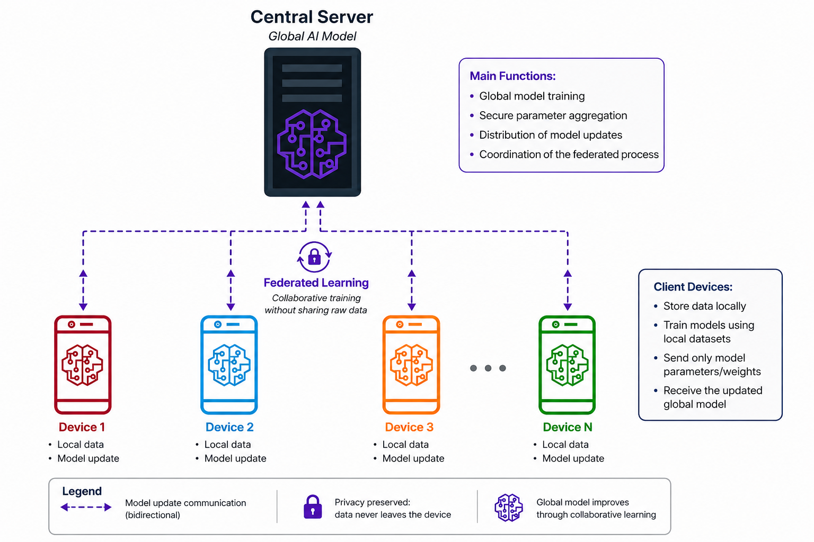

# NVIDIA FLARE: how the framework works, and how to build a federation

**What this covers.** NVIDIA FLARE as a framework. What federated learning is and what
makes it hard, what FLARE contributes to that, its architecture, its three programming
layers, what a job really is, how a production deployment is provisioned and secured, and
the order in which you build one from nothing.

**What this is not.** A guide to any single application. The worked figures come from a
real deployment, a federated breast-MRI classification study, but they are used only to
make the framework's ideas concrete.

**What you need.** Python 3.9 or later, and working knowledge of PyTorch or TensorFlow. No
prior federated learning experience is assumed.

**Versions.** Every class name, method signature, configuration key, file path and CLI
command below was read from **NVFLARE 2.8.1**. Documentation links are collected in §21.

---

# Part I — The concepts

## 1. The problem federated learning solves

Some of the most valuable training data in the world cannot be collected into one place.
Patient scans are held under regulation that forbids them leaving the hospital. Bank
transaction records are held under contracts that forbid pooling. Text typed on a phone
belongs to the person who typed it.

The data exists. Permission to centralise it does not.

Federated learning inverts the usual arrangement. Instead of moving data to the model, it
moves the model to the data.



The cycle is short enough to state in four lines:

1. A central server holds a global model and sends a copy to every participating site.
2. Each site trains that copy on data that never leaves its own machine.
3. Each site sends back only the updated weights.
4. The server combines the updates into a new global model, and the cycle repeats.

After enough cycles, the global model has learned from every site's data without any site
having disclosed a single record.

### 1.1 Two settings, with different problems

The literature divides federated learning into two regimes, and they are different enough
that a technique from one is often useless in the other.

| | Cross-device | Cross-silo |
|---|---|---|
| Participants | thousands to millions of phones | a handful of institutions |
| Availability | intermittent; most are offline at any moment | stable; they stay connected |
| Data per participant | small | large |
| Identity | anonymous, unauthenticated | named, contractually bound, authenticated |
| Typical use | keyboard prediction, on-device personalisation | hospitals, banks, manufacturers |

**NVIDIA FLARE is built for cross-silo.** That choice explains much of its design:
per-participant certificates, an administrative console, long-lived processes, and the
assumption that a site that goes missing is a fault to be reported rather than normal
behaviour.

### 1.2 What federating actually costs you

It is worth being honest about this up front, because it shapes everything that follows.

- **You lose the ability to shuffle.** Centralised training relies on each batch being a
  random sample of the whole distribution. In a federation, each site's batches come from
  that site alone.
- **You lose a single view of the data.** No one can inspect the pooled dataset, so the
  usual sanity checks are unavailable.
- **You gain a communication cost.** Every round moves the model across the network, twice
  per site.
- **You gain a coordination problem.** Sites have different hardware, different speeds, and
  different failure modes.

A federated framework is, in the end, machinery for managing exactly these four costs.

---

## 2. What FLARE is, and what it is not

FLARE stands for *Federated Learning Application Runtime Environment*. The important word
is **runtime**.

FLARE is a distributed task-execution system. It knows who the participants are,
authenticates each of them, hands out tasks, collects replies, and keeps the cycle going
when something fails.

What it is **not** is a machine learning library. It defines no model, no loss function, no
optimiser. It has no concept of an image or a token. That remains PyTorch's job, or
TensorFlow's, or your own.

This separation is the founding idea, and nearly everything that seems strange about FLARE
becomes reasonable once you accept it. Consider what follows from it:

| Because FLARE is agnostic about the payload… | …this becomes possible |
|---|---|
| it never inspects your weights | any framework works, including one it has never heard of |
| it never assumes the task is training | the same machinery runs federated statistics, evaluation, or an arbitrary protocol |
| it separates *what* from *where* | the same job runs on a laptop simulator and on real infrastructure |
| it treats the payload as an opaque envelope | privacy filters can be inserted without the job knowing |

The price is that FLARE will not do your machine learning for you, and will not warn you
when your machine learning is wrong. It is a transport and coordination layer that happens
to ship some federated algorithms in the box.

---

## 3. The mental model: tasks, not rounds

Do not begin by thinking about rounds of training. Begin here:

> A **controller** runs on the server and issues **tasks**. An **executor** runs on each
> client and answers tasks. What travels between them is a **Shareable**, which is a
> serialisable dictionary.

Federated learning is one usage pattern of that, and nothing more. The controller issues a
"train" task, each executor replies with weights, the controller combines them and issues
the task again. Thirty times. The framework has no idea that this is training.

### 3.1 The four communication primitives

| Primitive | Behaviour | Typical use |
|---|---|---|
| `broadcast` | the same task to all clients at once | FedAvg and most parallel algorithms |
| `send` | a task to named clients | targeted work, stragglers, retries |
| `relay` | the task visits clients one after another, in sequence | cyclic weight transfer |
| `*_and_wait` | the blocking form of each of the above | anything synchronous |

`broadcast_and_wait` is the workhorse. It takes `min_responses`, which is what makes a
round tolerant of a slow or absent site.

### 3.2 A round, traced end to end

This is the sequence that a FedAvg round actually performs. Knowing it makes the log files
readable.

```
SERVER                                          CLIENT (each site)
──────                                          ──────────────────
1. controller.control_flow() begins round r
2. builds a Task carrying the global weights
3. broadcast_and_wait(task, min_responses=N)
                        ──── task ────▶
                                                4. executor receives the task
                                                5. deserialises the weights
                                                6. trains locally for E epochs
                                                7. evaluates on local validation data
                                                8. packs weights + metrics + a weight
                                                   for aggregation
                        ◀─── result ───
9. collects N results
10. aggregates them into one set of weights
11. applies the result to the global model
12. asks the model selector whether this
    round is the best so far
13. persists the model if it is
14. round r+1, back to step 2
```

Steps 6 and 7 are yours. Everything else is the framework.

Note step 12 in particular. FLARE does not simply keep the last round. A **model selector**
component watches a metric that the clients report and retains the best global model. Which
metric is a configuration choice, and it is the kind of choice that quietly decides what
your experiment measured.

---

## 4. The participants

| Participant | Role | Holds |
|---|---|---|
| **server** | hosts the controller, aggregates, schedules jobs | the global model; no site data |
| **client** | one site. Runs the executor over local data | its own data, which never leaves |
| **admin** | the operator, human or script | its own certificate and the right to submit and control jobs |
| **relay** | optional. Forwards traffic for sites that cannot reach the server | nothing |

In a production deployment each of these is a **separate operating-system process with its
own identity and its own workspace on disk.** They authenticate to each other. There is no
sense in which they are threads pretending to be institutions.

Two ports are worth noticing in any real deployment. The federation traffic and the
administration channel are deliberately separated, so a site's firewall can expose one
without exposing the other.

The protocol between them is short. Down: the global model. Up: the updated weights. That
is all that crosses the network.

---

## 5. What a site actually holds

A point that diagrams tend to gloss over: each site has its own complete data setup, and
must partition it locally.

Three consequences follow, and all three are decisions the framework leaves to you:

- **Each site holds a different amount of data.** A site with six times another site's data
  should not have six times the influence by accident, nor exactly equal influence by
  accident. The aggregation weight is where you decide.
- **Each site keeps its own validation split.** The local validation set is what produces
  the metric the client reports, and therefore what the server's model selector acts on.
- **The test set is held out globally and never given to a site.** Otherwise there is no
  honest measure of the global model at all.

That last line is a design decision, not something FLARE enforces. The framework will
happily let you evaluate on data a client trained on.

---

## 6. The hard part: data that is not identically distributed

If every site held a random sample of the same distribution, federated learning would be
close to a solved problem. Sites do not. This is where the algorithms come from, so it is
worth being precise about what "different" can mean.

### 6.1 Quantity skew

The weakest form. Every site draws from the same distribution; they simply hold different
amounts.

Two sites of 800 patients each, or one of 1,400 and three of 200: in both cases every site
shows the same class proportions to within a fraction of a percentage point, and only the
totals differ. Quantity skew is real, and it matters for aggregation weighting, but it is
the mildest thing that can go wrong.

### 6.2 Label skew, and feature skew

The strong form. Each site's data comes from a genuinely different population.

Give each site one real hospital cohort rather than a slice of a shuffled pool, and the
class proportions can differ by tens of percentage points between them. The inputs differ
too, because different institutions use different equipment and different protocols.

This is the case the federated algorithms beyond FedAvg exist to address. When each site's
local optimum points in a different direction, naive averaging lands somewhere that is good
for nobody, an effect usually called **client drift**.

### 6.3 The taxonomy, briefly

The standard reference is Kairouz et al., *Advances and Open Problems in Federated
Learning*, which enumerates the ways site distributions can differ:

| Kind | What differs |
|---|---|
| Quantity skew | how much data each site holds |
| Label distribution skew | P(y) differs across sites |
| Feature distribution skew | P(x) differs; same labels, different-looking inputs |
| Concept drift | P(y\|x) differs; the same input means different things at different sites |
| Temporal skew | sites' data come from different periods |

**Why this belongs in a framework tutorial:** the amount of heterogeneity you face is what
decides which algorithm from §17 you should reach for, and FLARE makes that a one-line
change precisely so you can test rather than guess.

---

# Part II — Programming FLARE

## 7. Installation, and the three execution environments

```bash
pip install nvflare
```

FLARE offers three environments. **The same job runs in all three without modification.**
The difference is entirely infrastructure and identity.

| Environment | What it is | Certificates | Use it for |
|---|---|---|---|
| **Simulator** (`SimEnv`) | one process, clients are threads | none | developing and debugging quickly |
| **POC** (`PocEnv`) | separate processes, one machine | throwaway | rehearsing the operation |
| **Production** (`ProdEnv`) | separate processes, real PKI, one identity per participant | real | deployment |

This is the single most useful property to internalise early. Develop against the
simulator, rehearse in POC, deploy to production, and change one line each time.

Be aware of what the simulator hides, though. It will not reveal a certificate problem, a
firewall problem, a version mismatch between machines, or a path that exists only on your
laptop. Those appear for the first time in POC, which is exactly what POC is for.

---

## 8. Layer 1: the Recipe API

FLARE exposes three layers of abstraction. Most documentation mixes them, which is the main
source of early confusion. Start at the top; descend only when you must.

The Recipe API describes *the experiment*, not the mechanism.

```python
from nvflare.app_opt.pt.recipes.fedavg import FedAvgRecipe
from nvflare.recipe import SimEnv

from my_model import Net

recipe = FedAvgRecipe(
    name="fedavg",
    model=Net(),               # an nn.Module instance, or a dict config
    min_clients=2,
    num_rounds=30,
    train_script="client.py",  # the script each client runs
    train_args="--lr 1e-4",
)

env = SimEnv(num_clients=2)
run = recipe.execute(env)
```

Two objects, answering two different questions. **The recipe says what to run. The
environment says where.** To move the identical experiment onto a real deployment, replace
the environment and nothing else:

```python
from nvflare.recipe import ProdEnv

env = ProdEnv(
    startup_kit_location="/path/to/admin@example.com",
    username="admin@example.com",
)
run = recipe.execute(env)
```

`ProdEnv` logs into the running federation through the admin startup kit and submits the
job over the administration channel.

### 8.1 Passing the model as an object, not a path

`FedAvgRecipe` accepts `model` either as a built `nn.Module` or as a dict naming a class
path with arguments. Prefer the built object.

The failure the dict form invites is specific and silent: the server constructs the model
from the path using that class's defaults, each client constructs it from its own
configuration, and if the two disagree the run completes and produces numbers that mean
nothing. Passing an instance makes the server's copy the same object the clients build.

Note also that this applies to the **PyTorch** recipe,
`nvflare.app_opt.pt.recipes.fedavg`. The generic `nvflare.recipe.FedAvgRecipe` accepts
`model` only as a dict.

### 8.2 Attaching filters and files at recipe level

```python
recipe.add_client_output_filter(MyPrivacyFilter(), tasks=["train"])
recipe.add_server_input_filter(MyAuditFilter())
recipe.add_client_file("data_config.json")
recipe.add_client_config({"batch_size": 32})
```

Reference: [Job Recipe API](https://nvflare.readthedocs.io/en/main/user_guide/data_scientist_guide/job_recipe.html).

---

## 9. Layer 2: ModelController on the server, Client API on the client

When no ready-made recipe expresses what you want, write the server loop yourself.

### 9.1 The server side

```python
from nvflare.app_common.workflows.base_fedavg import BaseFedAvg

class MyFedAvg(BaseFedAvg):
    def run(self):
        model = self.load_model()

        for r in range(self.num_rounds):
            model.current_round = r

            clients = self.sample_clients(self.min_clients)
            results = self.send_model_and_wait(data=model, targets=clients)

            aggregate = self.aggregate(results)
            model = self.update_model(model, aggregate)

            self.save_model(model)
```

The available surface is small and complete:

| Method | Does |
|---|---|
| `load_model()` | returns the current global `FLModel` |
| `save_model(model)` | persists it |
| `sample_clients(n)` | picks participating clients for this round |
| `send_model(...)` | sends without blocking |
| `send_model_and_wait(...)` | sends and collects the replies |
| `aggregate(results)` | on `BaseFedAvg`: weighted average |
| `update_model(model, aggr)` | on `BaseFedAvg`: applies the aggregate |

There is no configuration file for the loop itself, and the loop reads as Python. Because
you own it, variations are easy: sample a subset of clients each round, skip aggregation
when too few reply, change the learning rate on the server, run two tasks per round.

Reference: [ModelController API](https://nvflare.readthedocs.io/en/main/programming_guide/controllers/model_controller.html).

### 9.2 The client side

The Client API turns an ordinary training script into a federated one. Note what is
*absent*: no class to subclass, no framework object to hold, no inversion of control.

```python
import nvflare.client as flare

flare.init()

while flare.is_running():

    # 1. receive the global model
    input_model = flare.receive()
    model.load_state_dict(input_model.params)

    # 2. train locally, exactly as you would normally
    for epoch in range(local_epochs):
        train_one_epoch(model, train_loader)

    accuracy = evaluate(model, val_loader)

    # 3. send the result back
    output_model = flare.FLModel(
        params=model.cpu().state_dict(),
        metrics={"accuracy": accuracy},
        meta={"NUM_STEPS_CURRENT_ROUND": len(train_loader.dataset)},
    )
    flare.send(output_model)
```

Three details in that loop matter more than they look.

**`while flare.is_running()`.** The script does not count rounds. The server decides when
the job is over, and this is how the client learns of it. A loop written as
`for r in range(30)` will appear to work and then hang or exit early the first time the
server's round count differs.

**`metrics`.** These are not decoration. The server's model selector reads them. If you
report nothing, the server has nothing to select on and keeps the last round instead of the
best.

**`meta`.** This is where the aggregation weight travels; see §11.2.

The full exported surface is `init`, `receive`, `send`, `is_running`, `get_site_name`,
`get_job_id`, `get_config`, `is_train`, `is_evaluate`, `is_submit_model`, `log`, `shutdown`
and `system_info`, plus the `@flare.train` and `@flare.evaluate` decorators for a
function-style alternative.

Reference: [Client API](https://nvflare.readthedocs.io/en/main/programming_guide/execution_api_type/client_api.html).

---

## 10. Layer 3: Controller and Executor

The original API, and the one everything above is built on. Work here when you need
coordination that FLARE does not already provide: a custom protocol, a multi-stage
workflow, or tasks that are not model updates at all.

```python
from nvflare.apis.impl.controller import Controller
from nvflare.apis.controller_spec import Task
from nvflare.apis.shareable import Shareable

class MyController(Controller):

    def start_controller(self, fl_ctx):
        self.log_info(fl_ctx, "controller starting")

    def control_flow(self, abort_signal, fl_ctx):
        task = Task(name="my_task", data=Shareable())
        self.broadcast_and_wait(
            task=task,
            fl_ctx=fl_ctx,
            min_responses=2,
            abort_signal=abort_signal,
        )

    def stop_controller(self, fl_ctx):
        pass
```

And on the client:

```python
from nvflare.apis.executor import Executor
from nvflare.apis.shareable import Shareable, make_reply
from nvflare.apis.fl_constant import ReturnCode

class MyExecutor(Executor):

    def execute(self, task_name, shareable, fl_ctx, abort_signal):
        if task_name != "my_task":
            return make_reply(ReturnCode.TASK_UNKNOWN)

        # ... do the work, watching abort_signal.triggered ...

        result = Shareable()
        result["my_output"] = 42
        return result
```

Two objects appear here that the upper layers hide:

**`FLContext`** is per-run key/value state shared between components on one side of the
connection. It is how a filter, a controller and a component find each other without being
wired together explicitly.

**`abort_signal`** is how a job is cancelled. Long-running work should check
`abort_signal.triggered` periodically, or an aborted job will sit there until the epoch
ends.

Reference: [Controllers and Controller API](https://nvflare.readthedocs.io/en/main/programming_guide/controllers/controllers.html),
[Executor](https://nvflare.readthedocs.io/en/main/programming_guide/execution_api_type/executor.html).

---

## 11. What actually travels

### 11.1 FLModel

At layers 1 and 2, the object going back and forth is `FLModel`. The same type travels in
both directions, which is worth pausing on: the server sends an `FLModel` and receives
`FLModel`s back.

| Field | Contents |
|---|---|
| `params` | the weights |
| `params_type` | `FULL` (the whole model) or `DIFF` (only the change) |
| `optimizer_params` | optimiser state, if you choose to send it |
| `metrics` | metrics the client reports |
| `current_round` | which round this is |
| `meta` | free-form dictionary |

`params_type` deserves a decision rather than a default. `DIFF` moves only what changed,
which matters when the model is large or the link is slow, and it is also what some
server-side algorithms expect. FLARE will not choose for you.

### 11.2 The aggregation weight

When the server averages, it needs to know how much each site's update counts. That number
travels in `meta`, conventionally under `NUM_STEPS_CURRENT_ROUND`.

The choice is yours and it is not cosmetic:

| Weight by | Consequence |
|---|---|
| number of training samples | the standard FedAvg weighting; a site with more data counts more |
| number of optimiser steps | similar, but sensitive to batch size differences between sites |
| equal weights | every institution has an equal voice regardless of size |
| a domain unit | e.g. patients rather than images, so a site whose records happen to be longer does not gain influence |

That last row is the one people get wrong. If your natural record is a patient but your
training rows are image slices, weighting by slices silently gives more influence to sites
whose patients happen to have more slices, which is not the same as holding more evidence.

### 11.3 Shareable and DXO

Underneath, an `FLModel` is carried by a `Shareable`, which holds a **DXO**, a *Data
Exchange Object*: an envelope with a declared data kind, the payload, and metadata.

The DXO exists so that a filter can inspect and transform a payload without understanding
what it means. That is the entire reason for the extra layer, and it is why the next
section is possible at all.

---

## 12. Filters

A filter sits between the executor and the wire, or between the wire and the controller. It
receives the DXO and may alter it. Differential privacy, percentile clipping, excluding
particular layers, and stripping metadata are all filters.

There are four attachment points, and they are not interchangeable:

| Point | Sees |
|---|---|
| client output | what this site is about to send |
| client input | what this site just received |
| server output | what the server is about to broadcast |
| server input | what the server just received from a site |

The point that is easy to miss: **a filter can be imposed by the site rather than by the
job.** A hospital can configure a filter that every job submitted to it must pass through,
including a job written by someone else. It is a governance mechanism as much as a
technical one, and it is the main reason FLARE keeps the payload in a typed envelope
instead of shipping raw tensors.

---

# Part III — The job and the system

## 13. The job: what is actually shipped

### 13.1 A job is a folder

```
my_job/
├── meta.json
└── app/
    ├── config/
    │   ├── config_fed_server.json
    │   └── config_fed_client.json
    └── custom/
        └── (your Python code)
```

When you use the Recipe or Job APIs these files are generated for you. It is still worth
knowing what they contain, because this is what actually lands on each machine, and because
a job that fails at deployment fails here.

### 13.2 meta.json

```json
{
    "name": "my_job",
    "resource_spec": {},
    "min_clients": 3,
    "deploy_map": {
        "app": ["@ALL"]
    }
}
```

| Key | Meaning |
|---|---|
| `deploy_map` | which app goes to which sites. `"@ALL"` means every connected site |
| `min_clients` | how many must be present before the job starts |
| `mandatory_clients` | which specific sites must be present |
| `resource_spec` | resources each site must be able to provide |

`deploy_map` causes more first-time failures than anything else in FLARE. A job naming four
sites that finds three will sit in the queue, and the reason is not always obvious from the
log. Worse, `"@ALL"` means *all currently connected*, so the same job can quietly run with a
different number of sites on a different day.

### 13.3 config_fed_server.json

The server config names the workflow and the components around it:

```json
{
    "format_version": 2,
    "workflows": [
        {
            "id": "controller",
            "path": "nvflare.app_common.workflows.fedavg.FedAvg",
            "args": {"num_rounds": 30, "aggregation_weights": {}}
        }
    ],
    "components": [
        {
            "id": "model_selector",
            "path": "nvflare.app_common.widgets.intime_model_selector.IntimeModelSelector",
            "args": {"key_metric": "val_balanced_accuracy"}
        },
        {
            "id": "persistor",
            "path": "nvflare.app_opt.pt.file_model_persistor.PTFileModelPersistor",
            "args": {"model": {"path": "my_module.MyModel", "args": {}}}
        }
    ],
    "task_data_filters": [],
    "task_result_filters": []
}
```

Everything is addressed by class path and arguments; this is FLARE's component system, and
it is how a job can name code that FLARE has never seen. Three roles appear here worth
naming:

- the **workflow**, which is the controller,
- the **persistor**, which knows how to write the global model to disk,
- the **model selector**, which watches `key_metric` and decides which round to keep.

### 13.4 config_fed_client.json

```json
{
    "format_version": 2,
    "executors": [
        {
            "tasks": ["*"],
            "executor": {
                "path": "nvflare.app_opt.pt.in_process_client_api_executor.PTInProcessClientAPIExecutor",
                "args": {
                    "task_script_path": "client.py",
                    "task_script_args": "--local-epochs 1 --num-rounds 30"
                }
            }
        }
    ],
    "components": [],
    "task_data_filters": [],
    "task_result_filters": []
}
```

The executor here is the bridge that runs your Client API script. Two variants exist:
in-process, which is faster and shares memory, and an external-process launcher, which
isolates the training run so a crash in your code does not take the client down with it.

**`task_script_path` should be relative.** FLARE resolves a relative path inside the job's
own `custom/` directory, where the shipped copy lives. An absolute path is interpreted as a
path on the machine the job lands on, which is usually a machine that has never seen your
repository.

### 13.5 The lifecycle

1. The admin submits the job.
2. It enters a queue on the server.
3. The **scheduler** waits until `min_clients` and `mandatory_clients` are satisfied.
4. The app is deployed to the participating sites.
5. Each site starts a training process.
6. The job runs; results land in the server workspace.
7. The admin downloads them.

---

## 14. Provisioning and PKI

In production you do not configure participants by hand. You write a `project.yml` and run
the provisioning tool.

### 14.1 project.yml

```yaml
api_version: 3

name: my_project
description: A federated project

participants:
  - name: server
    type: server
    org: coordinating_centre
    fed_learn_port: 8002     # clients connect here
    admin_port: 8003         # the admin API connects here
    default_host: localhost

  - {name: site_1, type: client, org: org_a}
  - {name: site_2, type: client, org: org_b}

  - {name: admin@example.com, type: admin, org: coordinating_centre,
     role: project_admin}

builders:
  # ... the chain; see below
```

Two practical notes that cost people an afternoon each. The two ports are separate on
purpose, so a site's firewall can expose the federation port without exposing the
administration channel. And an admin name is validated as a full email address, top-level
domain included, so `admin@example` is rejected at provisioning time.

### 14.2 Running it

```bash
nvflare provision -p project.yml -w workspace
```

Provisioning is a chain of **builders**, and the chain is extensible. Those shipped with the
framework include:

| Builder | Produces |
|---|---|
| `cert` | the root CA, and a certificate/key pair per participant |
| `static_file` | the start-up scripts and configuration files |
| `workspace` | each participant's directory tree |
| `signature` | signatures over the generated files, to detect tampering |
| `docker` | a `docker.sh` per participant |
| `he` | the homomorphic encryption context, if used |
| `aws`, `azure` | cloud deployment scripts |

Re-provisioning writes a new numbered output directory rather than overwriting the previous
one, so previous kits are never silently destroyed.

### 14.3 Startup kits

The output is one **startup kit** per participant: a folder holding that participant's
certificate, its private key, the root CA certificate, and the scripts that start it. You
copy `site_1`'s folder to `site_1`'s machine, and nothing else.

The trust hierarchy is deliberately simple. One project root CA signs everybody. Each
participant trusts the root, and therefore trusts the others. No private key is ever shared,
and no private key travels back to the coordinating centre.

### 14.4 Provision more participants than any one job uses

A pattern worth adopting. If you provision every site you might ever use, certificates stay
identical across every experiment, and a difference between two results can never be a
difference in PKI. A job that uses two of four provisioned sites is perfectly normal; it is
`min_clients` and `deploy_map` that decide, not the provisioning.

Reference: [Provisioning in NVIDIA FLARE](https://nvflare.readthedocs.io/en/main/programming_guide/provisioning_system.html).

---

## 15. Security

**Mutual TLS.** Both ends present a certificate. The client verifies the server and the
server verifies the client. A process without a valid startup kit does not join the
federation, and there is no shared password to leak.

**Authorisation is separate from authentication.** A policy file defines who may do what,
by role: who may submit a job, who may abort one, who may shut the system down. Preview the
policy before trusting it:

```bash
nvflare authz-preview -p /path/to/authorization.json
```

**Transport.** The communication layer ships drivers for gRPC, TCP and HTTP, and the same
application code runs over any of them.

**What this establishes, and what it does not.** Provisioning gives you identity and an
encrypted channel. It does not by itself give you privacy of the model contents: weights can
carry information about the data they were trained on, and both membership inference and
reconstruction attacks are active research areas. Privacy filters and homomorphic encryption
address that, and both are deliberate choices, not defaults you inherit.

Reference: [Security Overview](https://nvflare.readthedocs.io/en/main/system_architecture/security_overview.html).

---

## 16. The algorithms that ship with it

FLARE requires no particular algorithm. These come with the installation as PyTorch recipes.

| Recipe | What it is | What it is for |
|---|---|---|
| `fedavg` | weighted average of the client updates | the baseline of the field |
| `fedprox` | a proximal penalty on the client, anchoring it to the received model | heterogeneous data across sites |
| `fedopt` | treats the mean update as a pseudo-gradient and applies a server-side optimiser | faster or steadier convergence |
| `scaffold` | control variates correcting each client's drift | strongly non-IID data |
| `cyclic` | the model visits one site after another, with no aggregator | when there is no central coordinator |
| `swarm` | decentralised coordination between clients | removing the server as a single point |
| `fedavg_he` | FedAvg under homomorphic encryption | the server aggregates without seeing the weights |
| `fedeval` | evaluates each model against every site's data | measuring generalisation across sites |

`ditto`, for per-site personalisation, lives in `nvflare.app_opt.pt`. `fedstats` computes
federated statistics with no training at all.

### 16.1 Which side does an algorithm live on?

This is the point that removes most of the confusion around this literature.

| Algorithm | Server changes | Client changes |
|---|---|---|
| FedAvg | the aggregation | nothing |
| **FedProx** | **nothing** | an extra term in the local loss |
| **FedOpt** | an optimiser step | **nothing** |
| SCAFFOLD | maintains control variates | applies them |

FedProx adds `mu/2 · ‖w_local − w_global‖²` to the local objective, which keeps a site from
drifting far from the model it was given. Server-side aggregation is untouched. FedOpt
treats the mean client update as a pseudo-gradient and takes an optimiser step with it;
clients are untouched, and SGD with learning rate 1.0 and no momentum reduces exactly to
FedAvg.

Because they act on different sides, FedProx and FedOpt are **orthogonal, not
alternatives**. They can be combined.

A practical warning that follows: if an algorithm's effect is entirely client-side, a client
that receives the coefficient and ignores it is silently running FedAvg while your results
table says otherwise. Nothing will warn you. Assert the coefficient is non-zero where it is
supposed to be.

Primary sources: McMahan et al. 2017 (FedAvg), Li et al. 2020 (FedProx), Reddi et al. 2021
(adaptive federated optimisation), Karimireddy et al. 2020 (SCAFFOLD).

---

## 17. The command line

| Command | Purpose |
|---|---|
| `nvflare provision` | generate startup kits from `project.yml` |
| `nvflare poc` | bring up the rehearsal mode |
| `nvflare job` | create, validate and submit jobs |
| `nvflare recipe` | operate through the Recipe API |
| `nvflare preflight-check` | verify a participant can start, before trying |
| `nvflare authz-preview` | evaluate the authorisation policy |
| `nvflare dashboard` | the web interface for project management |
| `nvflare system` | status, version, shutdown |
| `nvflare cert` | certificate operations |
| `nvflare simulator` | the simulator; marked deprecated in 2.8 |

`preflight-check` is underused. It tells a site whether it can reach the server, whether its
certificate is valid, and whether its ports are open, before you spend an afternoon reading
connection logs.

---

# Part IV — Practice

## 18. Building a federation from nothing, in order

Steps 1 to 4 are done once. Steps 5 to 8 repeat for every experiment.

**1. Decide the participants and write `project.yml`.** Server, every site, at least one
admin. Provision more sites than your first job needs.

**2. Provision.**

```bash
nvflare provision -p project.yml -w workspace
```

**3. Distribute the startup kits.** One folder per participant, to that participant's
machine. Private keys do not travel back.

**4. Start the federation.** Server first, then the sites. Each authenticates and registers.

```bash
# on the server machine
./workspace/prod_00/server/startup/start.sh

# on each site machine
./workspace/prod_00/site_1/startup/start.sh
```

Confirm before going further:

```bash
nvflare preflight-check --package_path ./workspace/prod_00/site_1
```

**5. Write the client training script.** Ordinary PyTorch, plus the three Client API calls
of §9.2.

**6. Write the job.** Start from a ready-made recipe. Develop against `SimEnv` until it
runs end to end.

**7. Submit it,** through the admin console or with `ProdEnv` from Python.

**8. Collect the results** from the server workspace.

The move from step 6 to step 7 is a change of environment object, not of code. If it turns
out to be more than that, something in your job is bound to your development machine, and
that is the bug.

---

## 19. Failure modes worth knowing before you meet them

| Symptom | Usual cause | Fix |
|---|---|---|
| Job submitted, never starts | `deploy_map` or `min_clients` names more sites than are connected | reconcile the job with the federation, not the reverse |
| A site will not register after restarting | a stale registration held by the server | restart the **server**, not the client |
| Job runs, numbers are meaningless | server and clients built different architectures | pass a built model object, not a class path with defaults |
| The training script never exits | the loop does not test `flare.is_running()` | fix the loop condition |
| Provisioning rejects the admin entry | the admin name is not a full email address | include a top-level domain |
| A site is unreachable | federation port and admin port are separate | check which the firewall exposes |
| Aborting a job leaves it running | the executor never checks `abort_signal` | test it inside long loops |
| The saved model is not the best one | no `key_metric`, or clients report no metrics | report metrics and configure the selector |
| Results differ between two identical runs | the seed fixes initialisation, not kernel selection or worker ordering | measure the spread before trusting a difference |

---

## 20. A short glossary

| Term | Meaning |
|---|---|
| **Job** | a folder holding the configs and code for one federated run |
| **App** | the part of a job deployed to a participant |
| **Task** | one unit of work the controller issues to clients |
| **Controller** | the server-side object that issues tasks |
| **Executor** | the client-side object that answers them |
| **Shareable** | the serialisable dictionary that travels between them |
| **DXO** | typed envelope inside a Shareable, so filters can act on it |
| **FLModel** | the high-level payload: params, metrics, round, meta |
| **FLContext** | per-run shared state on one side of the connection |
| **Filter** | a transformation applied to a DXO in transit |
| **Recipe** | a high-level description of an experiment |
| **ExecEnv** | where a recipe runs: `SimEnv`, `PocEnv` or `ProdEnv` |
| **Startup kit** | one participant's certificates, keys and start scripts |
| **Provisioning** | generating startup kits from `project.yml` |

---

## 21. Documentation map

| Topic | Page |
|---|---|
| Installation | https://nvflare.readthedocs.io/en/main/installation.html |
| Quick start | https://nvflare.readthedocs.io/en/main/quickstart.html |
| Job Recipe API | https://nvflare.readthedocs.io/en/main/user_guide/data_scientist_guide/job_recipe.html |
| Client API | https://nvflare.readthedocs.io/en/main/programming_guide/execution_api_type/client_api.html |
| ModelController API | https://nvflare.readthedocs.io/en/main/programming_guide/controllers/model_controller.html |
| Controllers | https://nvflare.readthedocs.io/en/main/programming_guide/controllers/controllers.html |
| Executor | https://nvflare.readthedocs.io/en/main/programming_guide/execution_api_type/executor.html |
| Provisioning | https://nvflare.readthedocs.io/en/main/programming_guide/provisioning_system.html |
| Deployment overview | https://nvflare.readthedocs.io/en/main/user_guide/admin_guide/deployment/overview.html |
| Admin commands | https://nvflare.readthedocs.io/en/main/user_guide/admin_guide/deployment/operation.html |
| System configuration | https://nvflare.readthedocs.io/en/main/user_guide/admin_guide/configurations/system_configuration.html |
| Security overview | https://nvflare.readthedocs.io/en/main/system_architecture/security_overview.html |
| API reference | https://nvflare.readthedocs.io/en/main/apidocs/modules.html |
| Source | https://github.com/NVIDIA/NVFlare |

The documentation is versioned. `/en/main/` tracks the development branch; replace it with
`/en/2.6/` or similar for a specific release.